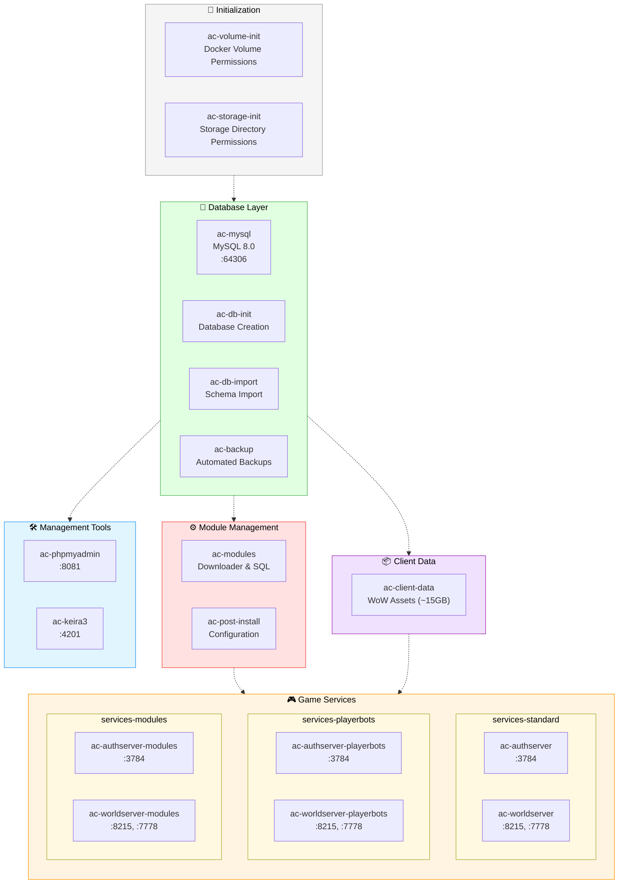

# AzerothCore Docker/Compose Stack

A complete containerized deployment of AzerothCore WoW 3.3.5a (Wrath of the Lich King) private server with 30+ enhanced modules and intelligent automation.

## 🚀 Quick Start

### Prerequisites
- **Docker** with Docker Compose
- **16GB+ RAM** and **32GB+ storage**
- **Linux/macOS/WSL2** (Windows with WSL2 recommended)

### Three Simple Steps

```bash
# 1. Get the code
git clone https://github.com/uprightbass360/acore-compose.git
cd acore-compose

# 2. Configure your server
./setup.sh

# 3. Build (if using modules/playerbots) and deploy
./build.sh    # Optional - only if you enabled C++ modules or playerbots
./deploy.sh   # Always required
```

**First deployment takes 30-60 minutes** for database setup and client data download. Subsequent starts are much faster.

See [Local Deployment](#-local-deployment) for detailed walkthrough.

---

## 📋 What Gets Installed Automatically

### ✅ Core Server Components
- **AzerothCore 3.3.5a** - WotLK server application
- **MySQL 8.0** - Database with intelligent initialization and restoration
- **Smart Module System** - Automated module management and source builds (compiles the [mod-playerbots fork](https://github.com/mod-playerbots/azerothcore-wotlk/tree/Playerbot) whenever modules need C++ changes)
- **phpMyAdmin** - Web-based database administration
- **Keira3** - Game content editor and developer tools

### ✅ Available Enhanced Modules

All modules are automatically downloaded, configured, and SQL scripts executed when enabled:

| Module | Description |
|--------|-------------|
| **[mod-solo-lfg](https://github.com/azerothcore/mod-solo-lfg)** | A solo-friendly queue that lets every player run dungeons without needing a premade group. |
| **[mod-solocraft](https://github.com/azerothcore/mod-solocraft)** | Automatically scales dungeon and raid encounters so solo players or small teams can clear content. |
| **[mod-autobalance](https://github.com/azerothcore/mod-autobalance)** | Adjusts creature health and damage in real time to keep fights tuned for the current party size. |
| **[mod-transmog](https://github.com/azerothcore/mod-transmog)** | Adds a transmogrification vendor so players can restyle gear without changing stats. |
| **[mod-npc-buffer](https://github.com/azerothcore/mod-npc-buffer)** | Provides a ready-to-use buff NPC who hands out class buffs, food, and utility spells. |
| **[mod-learn-spells](https://github.com/azerothcore/mod-learn-spells)** | Teaches class spells automatically at the correct level to streamline leveling. |
| **[mod-fireworks](https://github.com/azerothcore/mod-fireworks-on-level)** | Spawns celebratory fireworks whenever a player dings a new level. |
| **[mod-playerbots](https://github.com/mod-playerbots/mod-playerbots)** | Adds scriptable playerbot characters that can form dungeon parties, raid, and PvP with humans. |
| **[mod-aoe-loot](https://github.com/azerothcore/mod-aoe-loot)** | Lets characters loot multiple corpses with one click for faster farming. |
| **[mod-individual-progression](https://github.com/ZhengPeiRu21/mod-individual-progression)** | Tracks each character through Vanilla → TBC → WotLK progression, unlocking content sequentially. |
| **[mod-ahbot](https://github.com/azerothcore/mod-ahbot)** | Populates the auction house with configurable buying/selling behavior to keep markets active. |
| **[mod-dynamic-xp](https://github.com/azerothcore/mod-dynamic-xp)** | Tweaks XP gain based on population or custom rules to keep leveling flexible. |
| **[mod-1v1-arena](https://github.com/azerothcore/mod-1v1-arena)** | Creates a structured 1v1 ranked arena ladder for duel enthusiasts. |
| **[mod-phased-duels](https://github.com/azerothcore/mod-phased-duels)** | Moves duelers into their own phase to block interference and griefing. |
| **[mod-breaking-news](https://github.com/azerothcore/mod-breaking-news-override)** | Replaces the client breaking-news panel with server-managed announcements. |
| **[mod-boss-announcer](https://github.com/azerothcore/mod-boss-announcer)** | Broadcasts dramatic messages when raid bosses fall to your players. |
| **[mod-account-achievements](https://github.com/azerothcore/mod-account-achievements)** | Shares achievements across characters on the same account for persistent milestones. |
| **[mod-auto-revive](https://github.com/azerothcore/mod-auto-revive)** | Automatically resurrects characters on death—handy for casual PvE or testing realms. |
| **[mod-gain-honor-guard](https://github.com/azerothcore/mod-gain-honor-guard)** | Awards honor when players kill city guards, spicing up world PvP raids. |
| **[mod-arac](https://github.com/heyitsbench/mod-arac)** | Unlocks every race/class pairing so players can roll any combination they want (needs client patch). |
| **[mod-time-is-time](https://github.com/dunjeon/mod-TimeIsTime)** | Adds experimental time-twisting mechanics suited for custom events (requires extra tuning). |
| **[mod-pocket-portal](https://github.com/azerothcore/mod-pocket-portal)** | Gives players a portal gadget for quick travel to configured destinations. |
| **[mod-random-enchants](https://github.com/azerothcore/mod-random-enchants)** | Rolls randomised stat bonuses on loot to add Diablo-style gear chasing. |
| **[mod-pvp-titles](https://github.com/azerothcore/mod-pvp-titles)** | Restores classic honor titles with a configurable ranking ladder. |
| **[mod-npc-beastmaster](https://github.com/azerothcore/mod-npc-beastmaster)** | Adds an NPC who can teach, reset, and manage hunter pets for convenience. |
| **[mod-npc-enchanter](https://github.com/azerothcore/mod-npc-enchanter)** | Introduces an enchanting vendor who applies enchants directly for a fee. |
| **[mod-assistant](https://github.com/noisiver/mod-assistant)** | Spawns an all-purpose assistant NPC with heirlooms, professions, and convenience commands. |
| **[mod-reagent-bank](https://github.com/ZhengPeiRu21/mod-reagent-bank)** | Lets players stash crafting reagents with a dedicated banker NPC. |
| **[mod-black-market](https://github.com/Youpeoples/Black-Market-Auction-House)** | Backports the Mists-era Black Market Auction House via Eluna scripts. |
| **[mod-instance-reset](https://github.com/azerothcore/mod-instance-reset)** | Adds commands to reset instances quickly—useful for testing or events. |
| **[mod-challenge-modes](https://github.com/ZhengPeiRu21/mod-challenge-modes)** | Implements keystone-style timed runs with leaderboards and scaling modifiers. |
| **[mod-ollama-chat](https://github.com/DustinHendrickson/mod-ollama-chat)** | Connects playerbots to an Ollama LLM so they can chat with humans organically. |
| **[mod-player-bot-level-brackets](https://github.com/DustinHendrickson/mod-player-bot-level-brackets)** | Keeps bot levels spread evenly across configured brackets to match your player base. |
| **[mod-bg-slaveryvalley](https://github.com/Helias/mod-bg-slaveryvalley)** | Adds the Slavery Valley battleground complete with objectives and queue hooks. |
| **[mod-azerothshard](https://github.com/azerothcore/mod-azerothshard)** | Bundles AzerothShard tweaks: utility NPCs, scripted events, and gameplay improvements. |
| **[mod-worgoblin](https://github.com/heyitsbench/mod-worgoblin)** | Enables Worgen and Goblin characters, including necessary DB/DBC adjustments (client patch required). |
| **[StatBooster](https://github.com/AnchyDev/StatBooster)** | Lets players refine gear stats by rerolling random enchantments with special materials. |
| **[DungeonRespawn](https://github.com/AnchyDev/DungeonRespawn)** | Teleports dead players back to the dungeon entrance instead of a distant graveyard. |
| **[skeleton-module](https://github.com/azerothcore/skeleton-module)** | Provides a minimal AzerothCore module scaffold so you can build new features quickly. |
| **[eluna-ts](https://github.com/azerothcore/eluna-ts)** | Adds a TS-to-Lua workflow so Eluna scripts can be authored with modern tooling. |

### Module Summaries
- **mod-solo-lfg** – Enables the Dungeon Finder for solo players so every character can queue without a full party.
- **mod-solocraft** – Dynamically scales dungeon and raid encounters to match the current group size for flexible difficulty.
- **mod-autobalance** – Automatically adjusts creature health and damage to keep combat balanced for any party composition.
- **mod-transmog** – Adds the transmogrification system so players can change the appearance of their gear without losing stats.
- **mod-npc-buffer** – Introduces a convenient buff vendor that can apply class buffs, raid consumables, and other services.
- **mod-learn-spells** – Grants characters their class spells automatically at the appropriate levels to streamline leveling.
- **mod-fireworks** – Celebrates each level up by launching fireworks around the player for a festive visual effect.
- **mod-playerbots** – Spawns AI-controlled characters that can form parties, fill raids, and run battlegrounds alongside real players.
- **mod-aoe-loot** – Allows players to loot all nearby corpses with a single click, speeding up farming runs.
- **mod-individual-progression** – Tracks progression per character so content unlocks in a Vanilla → TBC → WotLK order.
- **mod-ahbot** – Provides an automated auction house with configurable buying and selling behavior to keep markets stocked.
- **mod-dynamic-xp** – Adjusts experience rates based on population or configured rules to keep leveling pace consistent.
- **mod-1v1-arena** – Adds a dedicated duel-style arena ladder where players can queue for structured 1v1 battles.
- **mod-phased-duels** – Moves duel participants into a phased area to prevent outside interference during the fight.
- **mod-breaking-news** – Replaces the character select breaking news panel with custom announcements hosted by your server.
- **mod-boss-announcer** – Broadcasts dramatic kill messages when raid bosses die to spotlight your community’s victories.
- **mod-account-achievements** – Shares achievements across characters on the same account so progress feels persistent.
- **mod-auto-revive** – Revives players automatically on death, ideal for testing realms or ultra-casual PvE environments.
- **mod-gain-honor-guard** – Awards honor for killing enemy guards to encourage city raids and world PvP skirmishes.
- **mod-arac** – Unlocks every race/class combination, letting players create any fantasy they can imagine (client patch required).
- **mod-time-is-time** – Provides time-manipulation gameplay hooks for custom events or encounter scripting (requires tuning).
- **mod-pocket-portal** – Gives players a personal portal device for fast travel to configured locations.
- **mod-random-enchants** – Rolls random stat bonuses on loot to introduce an ARPG-style layer of gear hunting.
- **mod-pvp-titles** – Restores classic PvP titles with configurable ranking so your battleground heroes stand out.
- **mod-npc-beastmaster** – Adds a beastmaster NPC who sells, resets, and manages hunter pets for convenience.
- **mod-npc-enchanter** – Offers enchanting services via an NPC who can apply chosen enchants for a fee.
- **mod-assistant** – Spawns an all-in-one assistant NPC that handles heirlooms, glyphs, professions, and utility commands.
- **mod-reagent-bank** – Creates a reagent banker NPC with extra storage tailored to crafters and raid prep.
- **mod-black-market** – Backports the Mists of Pandaria Black Market Auction House with Lua-powered bidding and rotation.
- **mod-instance-reset** – Adds commands and automation to reset instances on demand, useful for rapid testing.
- **mod-challenge-modes** – Introduces timed keystone-style dungeon runs with leaderboards and escalating modifiers.
- **mod-ollama-chat** – Connects playerbots to an Ollama LLM endpoint so they can converse with human players in natural language.
- **mod-player-bot-level-brackets** – Keeps playerbot levels evenly distributed by moving bots between configured brackets.
- **mod-bg-slaveryvalley** – Ports the custom Slavery Valley battleground complete with objectives and queue integration.
- **mod-azerothshard** – Bundles numerous AzerothShard quality-of-life tweaks, NPCs, and scripted content in one module.
- **mod-worgoblin** – Adds Worgen and Goblin as playable races, including start zones and necessary data patches.
- **StatBooster** – Lets players reroll item stats using a random enchant system to chase perfect gear.
- **DungeonRespawn** – Teleports dead players back to dungeon entrances instead of the nearest graveyard to cut down on downtime.
- **skeleton-module** – Provides a minimal module template with build hooks and examples for rapidly prototyping your own features.
- **eluna-ts** – Adds a TypeScript toolchain that transpiles to Eluna Lua scripts so you can author scripts with modern tooling.

### ✅ Automated Configuration
- **Intelligent Database Setup** - Smart backup detection, restoration, and conditional schema import
- **Backup Management** - Automated hourly/daily backups with intelligent restoration
- **Module Integration** - Automatic source builds when C++ modules are enabled
- **Realmlist Configuration** - Server address and port setup
- **Service Orchestration** - Profile-based deployment (standard/playerbots/modules)
- **Health Monitoring** - Container health checks and restart policies

### ✅ Lua Scripting Environment
- **Eluna Engine** - Built-in Lua scripting support with TypeScript compilation
- **Script Auto-loading** - Scripts automatically loaded from `storage/lua_scripts/`
- **Development Tools** - Script reloading with `.reload eluna` command
- **Volume Mounting** - Hot-reload development environment

---

## 🏗️ Local Deployment

Complete walkthrough for deploying on your local machine.

### Step 1: Initial Setup

**1.1 Clone the Repository**
```bash
git clone https://github.com/uprightbass360/acore-compose.git
cd acore-compose
```

**1.2 Run Interactive Setup**
```bash
./setup.sh
```

The setup wizard will guide you through:
- **Server Configuration**: IP address, ports, timezone
- **Module Selection**: Choose from 30+ available modules or use presets
- **Storage Paths**: Configure NFS/local storage locations
- **Playerbot Settings**: Max bots, account limits (if enabled)
- **Backup Settings**: Retention policies for automated backups
- **Permissions**: User/group IDs for file ownership

**Setup Output:** Creates `.env` file with your configuration

### Step 2: Build Images (if using C++ modules or playerbots)

```bash
./build.sh
```

**Skip this step if:**
- You're using only Lua/data modules
- You want vanilla AzerothCore without playerbots

**Required when:**
- Playerbots enabled (`MODULE_PLAYERBOTS=1`)
- Any C++ module enabled (check `needs_build: true` in `config/modules.json`)

**Build process:**
1. Clones AzerothCore source to `local-storage/source/`
2. Downloads and stages enabled modules
3. Compiles server binaries with modules
4. Creates Docker images tagged as `<project-name>:authserver-modules-latest`, etc.
5. Takes 20-60 minutes depending on hardware

### Step 3: Deploy Services

```bash
./deploy.sh
```

**Deployment flow:**
1. Validates environment configuration
2. Auto-selects Docker Compose profile:
   - `services-standard` - Vanilla AzerothCore
   - `services-playerbots` - Playerbot build
   - `services-modules` - Custom C++ modules build
3. Starts services in dependency order:
   - Database layer (`ac-mysql`, `ac-db-init`, `ac-db-import`, `ac-backup`)
   - Module management (`ac-modules`, `ac-post-install`)
   - Client data (`ac-client-data`)
   - Game servers (`ac-authserver`, `ac-worldserver`)
4. Tails worldserver logs (Ctrl+C to detach safely)

**First deployment takes longer** due to:
- Database schema import (~5-10 minutes)
- Client data download (~15GB, ~10-30 minutes)
- Module SQL execution

**Subsequent deployments** restore from backups and skip imports.

### Step 4: Create Admin Account

```bash
# Attach to worldserver console
docker attach ac-worldserver

# Create admin account
account create admin yourpassword
account set gmlevel admin 3 -1

# Detach: Ctrl+P, Ctrl+Q (NOT Ctrl+C - that stops the server!)
```

### Step 5: Connect Game Client

Edit `realmlist.wtf` in your WoW 3.3.5a client folder:
```
set realmlist 127.0.0.1
```

For custom ports:
```
set realmlist 127.0.0.1 8215
```

### Step 6: Access Management Tools

- **phpMyAdmin**: http://localhost:8081 - Database administration
- **Keira3**: http://localhost:4201 - World database editor

**Credentials:**
- Username: `root`
- Password: From `MYSQL_ROOT_PASSWORD` in `.env`

---

## 🚀 Remote Deployment

Deploy your configured realm to a remote server while building images locally.

### Remote Deployment Workflow

**Step 1: Configure & Build Locally**
```bash
# Interactive configuration with module selection
./setup.sh

# Build custom images (if using C++ modules or playerbots)
./build.sh --yes
```

**Step 2: Package & Transfer to Remote Host**

You can deploy remotely in two ways:

**Option A: Interactive (Recommended)**
```bash
./deploy.sh
# When prompted, select "2) Remote host (package for SSH deployment)"
# Follow prompts for hostname, username, and paths
```

**Option B: Non-Interactive**
```bash
./deploy.sh --yes \
  --remote-host your-server.com \
  --remote-user youruser \
  --remote-project-dir /home/youruser/acore-compose
```

Optional flags:
- `--remote-port 2222` - Custom SSH port
- `--remote-identity ~/.ssh/custom_key` - Specific SSH key
- `--remote-skip-storage` - Don't sync storage directory (fresh install on remote)

**Step 3: Deploy on Remote Host**
```bash
ssh your-server.com
cd /home/youruser/acore-compose
./deploy.sh --yes --no-watch
```

The remote deployment uses the images you built locally (no rebuild needed).

**Step 4: Verify Deployment**
```bash
./status.sh
# Check service logs
docker logs ac-worldserver -f
```

### What Gets Transferred

The remote deployment process transfers:
- ✅ Docker images (exported to `local-storage/images/`)
- ✅ Project files (scripts, configs, docker-compose.yml, .env)
- ✅ Storage directory (unless `--remote-skip-storage` is used)
- ❌ Build artifacts (source code, compilation files stay local)

### Module Presets
- Drop comma-separated module lists into `configurations/*.conf` (for example `configurations/playerbot-modules.conf`).
- `setup.sh` automatically adds these presets to the module menu and enables the listed modules when selected or when `--module-config <name>` is provided.
- Built-in presets:
  - `configurations/suggested-modules.conf` – default solo-friendly QoL stack.
  - `configurations/playerbots-suggested-modules.conf` – suggested stack plus playerbots.
  - `configurations/playerbot-only.conf` – playerbot-focused profile (adjust `--playerbot-max-bots`).
- Custom example:
  - `configurations/sam.conf` – Sam's playerbot-focused profile (set `--playerbot-max-bots 3000` when using this preset).

---

## 🏗️ Architecture Overview

### Container Profiles



**Profile Notes:**
- **Initialization**: Auto-runs, no profile needed
- **Database Layer**: `profile: db`
- **Client Data**: `profile: client-data` or `client-data-bots`
- **Module Management**: `profile: modules`
- **Game Services**: ONE of `services-standard`, `services-playerbots`, or `services-modules`
- **Management Tools**: `profile: tools`

### Service Inventory & Ports

| Service / Container | Role | Ports (host → container) | Profile |
|---------------------|------|--------------------------|---------|
| `ac-mysql` | MySQL 8.0 database | `64306 → 3306` | `db` |
| `ac-db-init` | Database schema initialization | – | `db` |
| `ac-db-import` | Database content import | – | `db` |
| `ac-backup` | Automated backup system | – | `db` |
| `ac-authserver` | Auth server (standard) | `3784 → 3724` | `services-standard` |
| `ac-worldserver` | World server (standard) | `8215 → 8085`, `7778 → 7878` | `services-standard` |
| `ac-authserver-playerbots` | Playerbots auth | `3784 → 3724` | `services-playerbots` |
| `ac-worldserver-playerbots` | Playerbots world | `8215 → 8085`, `7778 → 7878` | `services-playerbots` |
| `ac-authserver-modules` | Custom build auth | `3784 → 3724` | `services-modules` |
| `ac-worldserver-modules` | Custom build world | `8215 → 8085`, `7778 → 7878` | `services-modules` |
| `ac-client-data` | Client data fetcher | – | `client-data` |
| `ac-modules` | Module manager | – | `modules` |
| `ac-post-install` | Post-installation configuration | – | Auto-start |
| `ac-phpmyadmin` | Database admin UI | `8081 → 80` | `tools` |
| `ac-keira3` | Game content editor | `4201 → 8080` | `tools` |

### Storage Structure

The project uses a dual-storage approach for optimal performance:

**Primary Storage** (`STORAGE_PATH` - default: NFS mount or shared storage)
```
storage/
├── config/           # Server configuration files (.conf)
├── logs/             # Server log files
├── modules/          # Downloaded module source code
├── lua_scripts/      # Eluna Lua scripts (auto-loaded)
├── install-markers/  # Module installation state tracking
└── backups/          # Automated database backups
    ├── daily/        # Daily backups (retained per BACKUP_RETENTION_DAYS)
    └── hourly/       # Hourly backups (retained per BACKUP_RETENTION_HOURS)
```

**Local Storage** (`STORAGE_PATH_LOCAL` - default: `./local-storage`)
```
local-storage/
├── mysql-data/           # MySQL persistent data (tmpfs runtime + persistent snapshot)
├── client-data-cache/    # Downloaded WoW client data archives
├── source/               # AzerothCore source repository (created during builds)
│   └── azerothcore-playerbots/  # Playerbot fork (when playerbots enabled)
└── images/               # Exported Docker images for remote deployment
```

**Docker Volumes**
- `ac-client-data` - Unpacked game client data (DBC, maps, vmaps, mmaps)
- `client-data-cache` - Temporary storage for client data downloads

This separation ensures database and build artifacts stay on fast local storage while configuration, modules, and backups can be shared across hosts via NFS.

---

## 🛠️ Management Commands

### Health Monitoring
```bash
# Check realm status
./status.sh

# Watch services continuously
./status.sh --watch

# View service logs
docker logs ac-worldserver -f
docker logs ac-authserver -f

# Check module management
docker logs ac-modules --tail 50
```

### Web Tools Access

Once deployed, access the management tools in your browser:

```bash
# Database Management (phpMyAdmin)
http://YOUR_SERVER_IP:8081

# World Database Editor (Keira3)
http://YOUR_SERVER_IP:4201

# Replace YOUR_SERVER_IP with your actual server address
# Example: http://192.168.1.100:4201
```

**Note**: Initial Keira3 startup may show database connection errors until the world database import completes. This is expected behavior.

### Module Management

```bash
# Reconfigure modules via interactive setup
./setup.sh

# Build custom images with enabled modules
./build.sh                          # Interactive build (prompts for confirmation)
./build.sh --yes                    # Auto-confirm build
./build.sh --force                  # Force rebuild regardless of state

# Deploy with automatic profile selection
./deploy.sh                         # Auto-detects and deploys correct profile
./deploy.sh --profile standard      # Force standard AzerothCore
./deploy.sh --profile playerbots    # Force playerbots branch
./deploy.sh --profile modules       # Force custom modules build

# Lower-level module operations
./scripts/stage-modules.sh                    # Download enabled modules
./scripts/setup-source.sh                     # Initialize AzerothCore source
./scripts/copy-module-configs.sh              # Create module .conf files
./scripts/manage-modules-sql.sh               # Execute module SQL scripts

# Management tools
./scripts/deploy-tools.sh                     # Launch phpMyAdmin + Keira3
```

### Database Operations
```bash
# Access database via phpMyAdmin
open http://localhost:8081

# Direct MySQL access
docker exec -it ac-mysql mysql -u root -p

# Manual backup operations
./scripts/backup.sh                              # Create immediate backup
./scripts/restore.sh YYYYMMDD_HHMMSS            # Restore from specific backup

# User data backup/import utilities
./backup-export.sh [output_dir]                 # Export user accounts & characters
./backup-import.sh [backup_dir]                 # Import user data from backup

# View available backups
ls -la storage/backups/
```

### Container Management
```bash
# Start specific services
./start-containers.sh                           # Start all configured containers

# Stop services gracefully
./stop-containers.sh                            # Stop all containers

# Monitor service health
./status.sh                                     # Check realm status
./status.sh --watch                            # Watch services continuously
./status.sh --once                             # Single status check
```

### Deployment Verification
```bash
# Quick health check
./verify-deployment.sh --skip-deploy --quick

# Full deployment verification
./verify-deployment.sh
```

---

## 📜 Script Reference

### Core Deployment Scripts

#### `setup.sh` - Interactive Environment Configuration
Interactive `.env` generator with module selection, server configuration, and deployment profiles.

```bash
./setup.sh                                      # Interactive configuration
./setup.sh --module-config sam                 # Use predefined module preset
./setup.sh --playerbot-max-bots 3000          # Set playerbot limits
```

**Features:**
- Server address and port configuration
- Module selection with presets
- Storage path configuration (NFS/local)
- Playerbot configuration
- Backup retention settings
- User/group permission settings

#### `build.sh` - Custom Image Builder
Compiles AzerothCore with enabled C++ modules and creates deployment-ready Docker images.

```bash
./build.sh                                      # Interactive build
./build.sh --yes                               # Auto-confirm all prompts
./build.sh --force                             # Force rebuild regardless of state
./build.sh --source-path /custom/path         # Use custom source path
./build.sh --skip-source-setup                # Skip source repo setup
```

**What it does:**
- Clones/updates AzerothCore source repository
- Stages enabled modules into source tree
- Compiles server binaries with modules
- Builds and tags Docker images (`<project>:authserver-modules-latest`, etc.)
- Updates build state markers

#### `deploy.sh` - Deployment Orchestrator
Module-aware deployment with automatic profile selection and optional remote deployment.

```bash
./deploy.sh                                     # Interactive deployment
./deploy.sh --yes                              # Auto-confirm deployment
./deploy.sh --profile standard                 # Force standard AzerothCore
./deploy.sh --profile playerbots               # Force playerbots branch
./deploy.sh --profile modules                  # Force custom modules build
./deploy.sh --no-watch                         # Don't tail worldserver logs
./deploy.sh --keep-running                     # Deploy and exit immediately

# Remote deployment
./deploy.sh --remote-host server.com \
            --remote-user username \
            --remote-project-dir /path/to/project
```

**Automated workflow:**
1. Loads environment configuration
2. Detects required profile based on enabled modules
3. Triggers build if C++ modules or playerbots enabled
4. Launches Docker Compose with appropriate profiles
5. Optionally migrates stack to remote host

#### `cleanup.sh` - Project Cleanup Utility
Comprehensive cleanup with multiple destruction levels and safety checks.

```bash
./cleanup.sh                                   # Interactive cleanup
./cleanup.sh --soft                           # Stop containers only
./cleanup.sh --hard                           # Remove containers, networks, volumes
./cleanup.sh --nuclear                        # Full cleanup including images
./cleanup.sh --preserve-backups               # Retain backup data during cleanup
./cleanup.sh --dry-run                        # Preview cleanup actions
```

### Container Lifecycle Management

#### `start-containers.sh` - Service Startup
Starts all configured containers using appropriate profiles.

#### `stop-containers.sh` - Graceful Shutdown
Stops all containers with proper cleanup and data protection.

#### `status.sh` - Service Health Monitoring
```bash
./status.sh                                    # Single status check with summary
./status.sh --watch                           # Continuous monitoring mode
./status.sh --once                            # Script-friendly single check
```

### Database & Backup Management

#### `backup-export.sh` - User Data Export
Exports user accounts and character data for migration or backup purposes.

```bash
./backup-export.sh                            # Export to ExportBackup_<timestamp>/
./backup-export.sh /path/to/backup/dir       # Export to specific directory
```

**Output Structure:**
```
ExportBackup_YYYYMMDD_HHMMSS/
├── acore_auth.sql.gz         # User accounts
├── acore_characters.sql.gz   # Character data
└── manifest.json             # Backup metadata
```

#### `backup-import.sh` - User Data Import
Restores user accounts and characters from backup while preserving world data.

```bash
./backup-import.sh                            # Import from ImportBackup/
./backup-import.sh /path/to/backup           # Import from specific directory
```

**Required Files:**
- `acore_auth.sql[.gz]` - User accounts (required)
- `acore_characters.sql[.gz]` - Character data (required)
- `acore_world.sql[.gz]` - World data (optional)

### Module Management Scripts

#### `scripts/stage-modules.sh` - Module Staging
Downloads and stages enabled modules for source integration.

```bash
./scripts/stage-modules.sh                    # Stage all enabled modules
```

Called automatically by `build.sh`. Downloads enabled modules from GitHub and prepares them for compilation.

#### `scripts/setup-source.sh` - Source Repository Setup
Initializes or updates AzerothCore source repositories for compilation.

```bash
./scripts/setup-source.sh                     # Setup source for current configuration
```

Automatically clones the appropriate AzerothCore fork (main or playerbot) based on configuration.

#### `scripts/manage-modules.sh` - Module Management Container
Internal script that runs inside the `ac-modules` container to handle module lifecycle:
- Downloads module source code
- Executes module SQL scripts
- Manages module configuration files
- Tracks installation state

#### `config/modules.json` & `scripts/modules.py`
Central module registry and management system:
- **`config/modules.json`** - Declarative manifest defining all 30+ supported modules with metadata:
  - Repository URLs
  - Module type (cpp, data, lua)
  - Build requirements
  - SQL scripts and config files
  - Dependencies
- **`scripts/modules.py`** - Python helper that reads the manifest and `.env` to:
  - Generate `modules.env` with enabled module lists
  - Determine if rebuild is required
  - Provide module metadata to shell scripts

This centralized approach eliminates duplicate module definitions across scripts.

#### `scripts/manage-modules-sql.sh` - Module Database Integration
Executes module-specific SQL scripts for database schema updates.

#### `scripts/copy-module-configs.sh` - Configuration File Management
Creates module `.conf` files from `.dist.conf` templates for active modules.

```bash
./scripts/copy-module-configs.sh              # Create missing module configs
```

### Post-Deployment Automation

#### `scripts/auto-post-install.sh` - Post-Installation Configuration
Automated post-deployment tasks including module configuration, service verification, and initial setup.

```bash
./scripts/auto-post-install.sh                # Run post-install tasks
```

**Automated Tasks:**
1. Module configuration file creation
2. Service health verification
3. Database connectivity testing
4. Initial realm configuration

### Advanced Deployment Tools

#### `scripts/migrate-stack.sh` - Remote Deployment Migration
Exports and transfers locally built images to remote hosts via SSH.

```bash
./scripts/migrate-stack.sh \
  --host docker-server \
  --user sam \
  --project-dir /home/sam/acore-compose

./scripts/migrate-stack.sh \
  --host remote.example.com \
  --user deploy \
  --port 2222 \
  --identity ~/.ssh/deploy_key \
  --skip-storage
```

**What it does:**
1. Exports module images to `local-storage/images/acore-modules-images.tar`
2. Syncs project files (.env, docker-compose.yml, scripts) via rsync/scp
3. Syncs storage directory (unless `--skip-storage`)
4. Imports images on remote host

**Note:** Typically called via `./deploy.sh --remote-host` rather than directly.

#### `scripts/deploy-tools.sh` - Management Tools Deployment
Deploys web-based management tools (phpMyAdmin, Keira3) independently.

```bash
./scripts/deploy-tools.sh                     # Deploy management tools only
```

#### `verify-deployment.sh` - Deployment Validation
Comprehensive deployment verification with health checks and service validation.

```bash
./verify-deployment.sh                        # Full deployment verification
./verify-deployment.sh --skip-deploy         # Verify existing deployment
./verify-deployment.sh --quick               # Quick health check only
```

### Backup System Scripts

#### `scripts/backup-scheduler.sh` - Automated Backup Service
Runs inside the backup container to provide scheduled database backups.

**Features:**
- Hourly backups (retained for 6 hours)
- Daily backups (retained for 3 days)
- Automatic cleanup based on retention policies
- Database detection (includes playerbots if present)

---

---

## 🔄 Common Workflows

### Changing Module Configuration

```bash
# 1. Reconfigure modules
./setup.sh

# 2. Rebuild if you changed C++ modules
./build.sh --yes

# 3. Redeploy with new configuration
./deploy.sh
```

### Updating to Latest Code

```bash
# Pull latest changes
git pull origin main

# Rebuild images (if using modules/playerbots)
./build.sh --force

# Restart services
docker compose down
./deploy.sh
```

### Managing Services

```bash
# Check service status
./status.sh

# View logs
docker logs ac-worldserver -f
docker logs ac-authserver -f
docker logs ac-mysql -f

# Restart specific service
docker compose restart ac-worldserver

# Stop all services
./stop-containers.sh

# Start services
./start-containers.sh
```

### Database Management

```bash
# Backup user data
./backup-export.sh

# Restore user data
./backup-import.sh /path/to/backup

# Access database directly
docker exec -it ac-mysql mysql -u root -p
```

### Cleaning Up

```bash
# Soft cleanup (stop containers only)
./cleanup.sh --soft

# Hard cleanup (remove containers and networks)
./cleanup.sh --hard

# Nuclear cleanup (everything including images and data)
./cleanup.sh --nuclear --preserve-backups
```

---

## 🔧 Advanced Configuration

### Module-Specific Requirements

Some modules require additional manual configuration after deployment:

#### mod-playerbots
- Requires playerbots-specific AzerothCore branch
- Automatically handled when `MODULE_PLAYERBOTS=1` is set in setup

#### mod-individual-progression
- **Client patches required**: `patch-V.mpq` (found in module storage)
- **Server config**: Add `EnablePlayerSettings = 1` and `DBC.EnforceItemAttributes = 0` to worldserver.conf

#### mod-transmog / mod-npc-* modules
- **NPC spawning required**: Use GM commands to spawn service NPCs
- Examples:
  ```bash
  .npc add 190010    # Transmog NPC
  .npc add 290011    # Reagent Bank NPC
  # Check module docs for enchanter/beastmaster NPC IDs
  ```

#### mod-arac (All Races All Classes)
- **Client patches required**: `Patch-A.MPQ` (found in module storage)
- **Installation**: Players must copy to `WoW/Data/` directory
- **Server-side**: DBC files automatically applied during module installation

### Profile Selection

The deployment system uses Docker Compose profiles to manage different configurations:

| Profile | When Used | Image Source |
|---------|-----------|--------------|
| `services-standard` | No C++ modules, no playerbots | Upstream `acore/*` images |
| `services-playerbots` | `MODULE_PLAYERBOTS=1` + no other C++ modules | Project-built `<name>:*-playerbots` |
| `services-modules` | Any C++ module enabled (incl. playerbots + others) | Project-built `<name>:*-modules-latest` |

**Profile selection is automatic** - `deploy.sh` analyzes your `.env` and selects the appropriate profile.

### Build System

**When builds are required:**
- Playerbots enabled (`MODULE_PLAYERBOTS=1`)
- Any C++ module enabled (see `needs_build: true` in `config/modules.json`)

**Build workflow (`./build.sh`):**
1. Clones AzerothCore source to `local-storage/source/`
   - Uses [mod-playerbots fork](https://github.com/mod-playerbots/azerothcore-wotlk) when playerbots enabled
   - Uses [main AzerothCore](https://github.com/azerothcore/azerothcore-wotlk) otherwise
2. Stages enabled C++ modules into `modules/` directory within source
3. Compiles binaries using Dockerized build environment
4. Creates and tags images:
   - `<project>:authserver-playerbots` / `authserver-modules-latest`
   - `<project>:worldserver-playerbots` / `worldserver-modules-latest`
   - `<project>:client-data-playerbots` (playerbots only)
   - `<project>:db-import-playerbots` (playerbots only)

**Build time:** 20-60 minutes depending on hardware and module count

### MySQL Runtime Storage & Timezone Data

- `MYSQL_RUNTIME_TMPFS_SIZE` controls the in-memory datadir used by the MySQL container. Increase this value if you see `No space left on device` errors inside `/var/lib/mysql-runtime`.
- `MYSQL_INNODB_REDO_LOG_CAPACITY` increases redo log headroom (defaults to `512M`). Raise it further if logs report `log_checkpointer` lag.
- `HOST_ZONEINFO_PATH` should point to a host directory containing timezone definitions (defaults to `/usr/share/zoneinfo`). The path is mounted read-only so the container can load timezone tables without extra image customization. Set it to a valid directory on your host if your OS stores zoneinfo elsewhere.

---

## 🔧 Troubleshooting

### Common Issues

**Containers failing to start**
```bash
# Check container logs
docker logs <container_name>

# Verify network connectivity
docker network ls | grep azerothcore

# Check port conflicts
ss -tulpn | grep -E "(3784|8215|8081|4201)"
```

**Module not working**
```bash
# Check if module is enabled in environment
grep MODULE_NAME .env

# Verify module installation
ls storage/modules/

# Check module-specific configuration
ls storage/config/mod_*.conf*
```

**Database connection issues**
```bash
# Verify MySQL is running and responsive
docker exec ac-mysql mysql -u root -p -e "SELECT 1;"

# Check database initialization
docker logs ac-db-init
docker logs ac-db-import
```

**Source rebuild issues**
```bash
# Check rebuild logs
docker logs ac-modules | grep -A20 -B5 "rebuild"

# Verify source path exists
ls -la "${STORAGE_PATH_LOCAL:-./local-storage}/source/azerothcore/"

# Force source setup
./scripts/setup-source.sh
```

### Getting Help

1. **Check service status**: `./status.sh --watch`
2. **Review logs**: `docker logs <service-name> -f`
3. **Verify configuration**: Check `.env` file for proper module toggles
4. **Clean deployment**: Stop all services and redeploy with `./deploy.sh`

### Backup and Restoration System

The stack includes an intelligent backup and restoration system:

**Automated Backup Schedule**
- **Hourly backups**: Retained for 6 hours (configurable via `BACKUP_RETENTION_HOURS`)
- **Daily backups**: Retained for 3 days (configurable via `BACKUP_RETENTION_DAYS`)
- **Automatic cleanup**: Old backups removed based on retention policies

**Smart Backup Detection**
- **Multiple format support**: Detects daily, hourly, and legacy timestamped backups
- **Priority-based selection**: Automatically selects the most recent available backup
- **Integrity validation**: Verifies backup files before attempting restoration

**Intelligent Startup Process**
- **Automatic restoration**: Detects and restores from existing backups on startup
- **Conditional import**: Skips database import when backup restoration succeeds
- **Data protection**: Prevents overwriting restored data with fresh schema

**Backup Structure**
```
storage/backups/
├── daily/
│   └── YYYYMMDD_HHMMSS/          # Daily backup directories
│       ├── acore_auth.sql.gz
│       ├── acore_characters.sql.gz
│       ├── acore_world.sql.gz
│       └── manifest.json
└── hourly/
    └── YYYYMMDD_HHMMSS/          # Hourly backup directories
        ├── acore_auth.sql.gz
        ├── acore_characters.sql.gz
        └── acore_world.sql.gz

# User data import/export
ExportBackup_YYYYMMDD_HHMMSS/     # Created by backup-export.sh
├── acore_auth.sql.gz             # User accounts
├── acore_characters.sql.gz       # Character data
└── manifest.json

ImportBackup/                     # Used by backup-import.sh
├── acore_auth.sql[.gz]           # Required: accounts
├── acore_characters.sql[.gz]     # Required: characters
└── acore_world.sql[.gz]          # Optional: world data
```

---

## 📚 Advanced Deployment Options

### Custom Environment Configuration
```bash
# Setup with specific module preset
./setup.sh --module-config sam --playerbot-max-bots 3000

# Build with custom source path
./build.sh --source-path /path/to/custom/azerothcore --force

# Deploy with specific options
./deploy.sh --profile modules --no-watch --keep-running
```

### Manual Source Management
```bash
# Initialize/update AzerothCore source repository
./scripts/setup-source.sh

# Stage modules into source tree (called by build.sh)
./scripts/stage-modules.sh

# Build images from prepared source
./build.sh --skip-source-setup
```

### Manual Service Control
```bash
# Stop all services
docker compose --profile db --profile services-standard \
  --profile services-playerbots --profile services-modules \
  --profile client-data --profile modules --profile tools down

# Start specific profile
docker compose --profile db --profile services-playerbots --profile tools up -d

# Restart after configuration changes
docker compose restart ac-worldserver ac-authserver
```

### Force Rebuild
```bash
# Force complete rebuild (ignores build state markers)
./build.sh --force

# Clean build artifacts and rebuild
rm -rf local-storage/source local-storage/images
./build.sh
```

---

## 🧭 Ownership Hardening TODO

- [ ] MySQL container: prototype running as `${CONTAINER_USER}` (or via Docker userns remap/custom entrypoint) so shared `${STORAGE_PATH}` data stays user-owned while preserving required init privileges.

---

## 🎯 Next Steps After Installation

### In-Game Setup

1. **Create GM Account**
   ```bash
   docker attach ac-worldserver
   account create <username> <password>
   account set gmlevel <username> 3 -1
   ```

2. **Test Modules** - Verify enabled modules are working:
   - Solo LFG: Queue for a dungeon solo
   - Transmog: Use `.npc add 190010` to spawn transmog NPC
   - Playerbots: Use `.bot add` command (if enabled)

3. **Configure Realmlist** - Update server address in database:
   ```sql
   UPDATE acore_auth.realmlist
   SET address = 'your-public-ip', port = 8215
   WHERE id = 1;
   ```

### Server Administration

1. **Set Up Monitoring**
   ```bash
   # Watch server status continuously
   ./status.sh --watch

   # Monitor logs
   docker logs ac-worldserver -f
   ```

2. **Configure Backups**
   - Review retention settings in `.env`:
     - `BACKUP_RETENTION_DAYS=3`
     - `BACKUP_RETENTION_HOURS=6`
   - Test backup/restore:
     ```bash
     ./backup-export.sh
     ./backup-import.sh /path/to/backup
     ```

3. **Customize Modules**
   - Edit module configs in `storage/config/mod_*.conf`
   - Restart worldserver: `docker compose restart ac-worldserver`

4. **Add Lua Scripts**
   - Place scripts in `storage/lua_scripts/`
   - Auto-loaded on worldserver start
   - Reload with `.reload eluna` in-game

### Performance Tuning

1. **Database Optimization**
   - Adjust `MYSQL_INNODB_BUFFER_POOL_SIZE` in `.env`
   - Increase `MYSQL_RUNTIME_TMPFS_SIZE` for larger datasets

2. **Playerbot Scaling** (if enabled)
   - Tune `PLAYERBOT_MAX_BOTS` in `.env`
   - Monitor memory usage: `docker stats ac-worldserver`

3. **Network Configuration**
   - Open firewall ports:
     - `3784` (authserver)
     - `8215` (worldserver)
   - Configure NAT/port forwarding for public access

---

## 📄 Project Credits

This project builds upon:
- **[AzerothCore](https://github.com/azerothcore/azerothcore-wotlk)** - Core server application
- **[AzerothCore Module Community](https://github.com/azerothcore)** - Enhanced gameplay modules

### Key Features
- ✅ **Fully Automated Setup** - Interactive configuration and deployment
- ✅ **Intelligent Module System** - Automatic source builds and profile selection
- ✅ **Automated Backups** - Health checks, scheduled backups, and monitoring
- ✅ **Docker-Based** - Containerized deployment for easy setup and portability
- ✅ **Comprehensive Documentation** - Clear setup and troubleshooting guides
