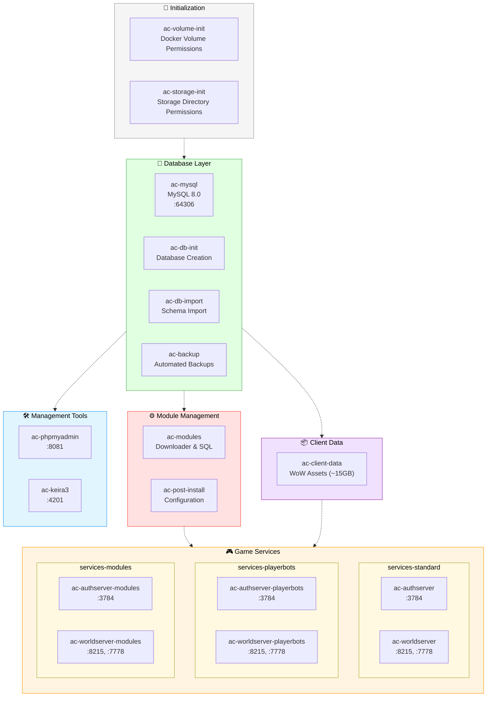

<div align="center">
  
</div>

# AzerothCore RealmMaster

A complete containerized deployment of AzerothCore WoW 3.3.5a (Wrath of the Lich King) private server with 93+ enhanced modules and intelligent automation.

## Table of Contents

- [Quick Start](#quick-start)
- [What You Get](#what-you-get)
- [Getting Started](#getting-started)
  - [Local Deployment](#local-deployment)
  - [Remote Deployment](#remote-deployment)
  - [Post-Installation Steps](#post-installation-steps)
- [Complete Module Catalog](#complete-module-catalog)
- [Management & Operations](#management--operations)
  - [Common Workflows](#common-workflows)
  - [Management Commands](#management-commands)
  - [Database Operations](#database-operations)
- [Advanced Configuration](#advanced-configuration)
  - [Architecture Overview](#architecture-overview)
  - [Build System](#build-system)
  - [Custom Configuration](#custom-configuration)
- [Script Reference](#script-reference)
- [Troubleshooting](#troubleshooting)
- [Credits & Next Steps](#credits--next-steps)

---

## Quick Start

### Prerequisites
- **Docker** with Docker Compose
- **16GB+ RAM** and **32GB+ storage**
- **Linux/macOS/WSL2** (Windows with WSL2 recommended)

### Three Simple Steps

```bash
# 1. Get the code
git clone https://github.com/uprightbass360/AzerothCore-RealmMaster.git
cd AzerothCore-RealmMaster

# 2. Configure your server
./setup.sh

# 3. Deploy (if using modules/playerbots) and deploy
./build.sh    # Optional - Will be triggered if required in deploy. c++ modules require compilation
./deploy.sh   # Always required - Supports ssh remote deploy or local
./status.sh   # Optional - Shows health and accesibility of all containers and current user data
```

**First deployment takes 30-60 minutes** for database setup and client data download. Subsequent starts are much faster.

See [Getting Started](#getting-started) for detailed walkthrough.

---

## What You Get

### ✅ Core Server Components
- **AzerothCore 3.3.5a** - WotLK server application with 93+ enhanced modules
- **MySQL 8.0** - Database with intelligent initialization and restoration
- **Smart Module System** - Automated module management and source builds
- **phpMyAdmin** - Web-based database administration
- **Keira3** - Game content editor and developer tools

### ✅ Automated Configuration
- **Intelligent Database Setup** - Smart backup detection, restoration, and conditional schema import
- **Backup Management** - Automated hourly/daily backups with intelligent restoration
- **Module Integration** - Automatic source builds when C++ modules are enabled
- **Service Orchestration** - Profile-based deployment (standard/playerbots/modules)

---

## Getting Started

Complete walkthrough for deploying on your local machine or remote server.

### Local Deployment

#### Step 1: Initial Setup

**1.1 Clone the Repository**
```bash
git clone https://github.com/uprightbass360/AzerothCore-RealmMaster.git
cd AzerothCore-RealmMaster
```

**1.2 Run Interactive Setup**
```bash
./setup.sh
```

The setup wizard will guide you through:
- **Server Configuration**: IP address, ports, timezone
- **Module Selection**: Choose from 30+ available modules or use presets
- **Storage Paths**: Configure NFS/local storage locations
- **Playerbot Settings**: Max bots, account limits (if enabled)
- **Backup Settings**: Retention policies for automated backups
- **Permissions**: User/group IDs for file ownership

**Setup Output:** Creates `.env` file with your configuration

#### Step 2: Build Images (if using C++ modules or playerbots)

```bash
./build.sh
```

**Skip this step if:**
- You're using only Lua/data modules
- You want vanilla AzerothCore without playerbots

**Required when:**
- Playerbots enabled (`MODULE_PLAYERBOTS=1`)
- Any C++ module enabled (modules with `"type": "cpp"` in `config/modules.json`)

**Build process:**
1. Clones AzerothCore source to `local-storage/source/`
2. Downloads and stages enabled modules
3. Compiles server binaries with modules
4. Creates Docker images tagged as `<project-name>:authserver-modules-latest`, etc.
5. Takes 20-60 minutes depending on hardware

#### Step 3: Deploy Services

```bash
./deploy.sh
```

**Deployment flow:**
1. Validates environment configuration
2. Auto-selects Docker Compose profile:
   - `services-standard` - Vanilla AzerothCore
   - `services-playerbots` - Playerbot build
   - `services-modules` - Custom C++ modules build
3. Starts services in dependency order:
   - Database layer (`ac-mysql`, `ac-db-init`, `ac-db-import`, `ac-backup`)
   - Module management (`ac-modules`, `ac-post-install`)
   - Client data (`ac-client-data`)
   - Game servers (`ac-authserver`, `ac-worldserver`)
4. Tails worldserver logs (Ctrl+C to detach safely)

**First deployment takes longer** due to:
- Database schema import (~5-10 minutes)
- Client data download (~15GB, ~10-30 minutes)
- Module SQL execution

**Subsequent deployments** restore from backups and skip imports.

#### Step 4: Create Admin Account

```bash
# Attach to worldserver console
docker attach ac-worldserver

# Create admin account
account create admin yourpassword
account set gmlevel admin 3 -1

# Detach: Ctrl+P, Ctrl+Q (NOT Ctrl+C - that stops the server!)
```

#### Step 5: Connect Game Client

Edit `realmlist.wtf` in your WoW 3.3.5a client folder:
```
set realmlist 127.0.0.1
```

For custom ports:
```
set realmlist 127.0.0.1 8215
```

#### Step 6: Access Management Tools

- **phpMyAdmin**: http://localhost:8081 - Database administration
- **Keira3**: http://localhost:4201 - World database editor

**Credentials:**
- Username: `root`
- Password: From `MYSQL_ROOT_PASSWORD` in `.env`

### Remote Deployment

Deploy your configured realm to a remote server while building images locally.

#### Remote Deployment Workflow

**Step 1: Configure & Build Locally**
```bash
# Interactive configuration with module selection
./setup.sh

# Build custom images (if using C++ modules or playerbots)
./build.sh --yes
```

#### Step 2: Package & Transfer to Remote Host

You can deploy remotely in two ways:

**Option A: Interactive (Recommended)**
```bash
./deploy.sh
# When prompted, select "2) Remote host (package for SSH deployment)"
# Follow prompts for hostname, username, and paths
```

**Option B: Non-Interactive**
```bash
./deploy.sh --yes \
  --remote-host your-server.com \
  --remote-user youruser \
  --remote-project-dir /home/youruser/AzerothCore-RealmMaster
```

Optional flags:
- `--remote-port 2222` - Custom SSH port
- `--remote-identity ~/.ssh/custom_key` - Specific SSH key
- `--remote-skip-storage` - Don't sync storage directory (fresh install on remote)

#### Step 3: Deploy on Remote Host
```bash
ssh your-server.com
cd /home/youruser/AzerothCore-RealmMaster
./deploy.sh --yes --no-watch
```

The remote deployment uses the images you built locally (no rebuild needed).

#### Step 4: Verify Deployment
```bash
./status.sh
# Check service logs
docker logs ac-worldserver -f
```

#### What Gets Transferred

The remote deployment process transfers:
- ✅ Docker images (exported to `local-storage/images/`)
- ✅ Project files (scripts, configs, docker-compose.yml, .env)
- ✅ Storage directory (unless `--remote-skip-storage` is used)
- ❌ Build artifacts (source code, compilation files stay local)

#### Module Presets
- Define JSON presets in `profiles/*.json`. Each file contains:
  - `modules` (array, required) – list of `MODULE_*` identifiers to enable.
  - `label` (string, optional) – text shown in the setup menu (emoji welcome).
  - `description` (string, optional) – short help text for maintainers.
  - `order` (number, optional) – determines the menu position (lower appears first).
  Example:

  ```json
  {
    "modules": ["MODULE_ELUNA", "MODULE_SOLO_LFG", "MODULE_SOLOCRAFT"],
    "label": "⭐ Suggested Modules",
    "description": "Baseline solo-friendly quality of life mix",
    "order": 1
  }
  ```
- `setup.sh` automatically adds these presets to the module menu and enables the listed modules when selected or when `--module-config <name>` is provided.
- Built-in presets:
  - `profiles/suggested-modules.json` – default solo-friendly QoL stack.
  - `profiles/playerbots-suggested-modules.json` – suggested stack plus playerbots.
  - `profiles/playerbots-only.json` – playerbot-focused profile (adjust `--playerbot-max-bots`).
- Custom example:
  - `profiles/sam.json` – Sam's playerbot-focused profile (set `--playerbot-max-bots 3000` when using this preset).

### Post-Installation Steps

#### Create Admin Account

```bash
# Attach to worldserver console
docker attach ac-worldserver

# Create admin account
account create admin yourpassword
account set gmlevel admin 3 -1

# Detach: Ctrl+P, Ctrl+Q (NOT Ctrl+C - that stops the server!)
```

#### Access Management Tools

- **phpMyAdmin**: http://localhost:8081 - Database administration
- **Keira3**: http://localhost:4201 - World database editor

**Credentials:**
- Username: `root`
- Password: From `MYSQL_ROOT_PASSWORD` in `.env`

#### Configure Server for Public Access

```sql
-- Update realmlist for public server
UPDATE acore_auth.realmlist
SET address = 'your-public-ip', port = 8215
WHERE id = 1;
```

See [Next Steps After Installation](#-credits--next-steps) for detailed setup and administration guidance.

---

## Complete Module Catalog

All modules are automatically downloaded, configured, and SQL scripts executed when enabled. Browse the complete collection of **93 modules** organized by category:

#### Automation

| Module | Description |
|--------|-------------|
| **[mod-ollama-chat](https://github.com/DustinHendrickson/mod-ollama-chat.git)** | Connects playerbots to an Ollama LLM so they can chat with humans organically |
| **[mod-player-bot-level-brackets](https://github.com/DustinHendrickson/mod-player-bot-level-brackets.git)** | Keeps bot levels spread evenly across configured brackets |
| **[mod-playerbots](https://github.com/mod-playerbots/mod-playerbots.git)** | Adds scriptable playerbot characters that can form dungeon parties, raid, and PvP with humans |
| **[npcbot-extended-commands](https://github.com/Day36512/Npcbot_Extended_Commands.git)** | Provides gear templates, transmog clearing, and chat features for NPC bots |

#### Quality of Life

| Module | Description |
|--------|-------------|
| **[mod-aoe-loot](https://github.com/azerothcore/mod-aoe-loot.git)** | Lets characters loot multiple corpses with one click for faster farming |
| **[mod-auto-revive](https://github.com/azerothcore/mod-auto-revive.git)** | Automatically resurrects characters on death—handy for casual PvE or testing realms |
| **[mod-fireworks-on-level](https://github.com/azerothcore/mod-fireworks-on-level.git)** | Spawns celebratory fireworks whenever a player dings a new level |
| **[mod-instance-reset](https://github.com/azerothcore/mod-instance-reset.git)** | Adds commands to reset instances quickly—useful for testing or events |
| **[mod-learn-spells](https://github.com/azerothcore/mod-learn-spells.git)** | Teaches class spells automatically at the correct level to streamline leveling |
| **[mod-solo-lfg](https://github.com/azerothcore/mod-solo-lfg.git)** | A solo-friendly queue that lets every player run dungeons without needing a premade group |

#### Gameplay Enhancement

| Module | Description |
|--------|-------------|
| **[DungeonRespawn](https://github.com/AnchyDev/DungeonRespawn.git)** | Teleports dead players back to the dungeon entrance instead of a distant graveyard |
| **[StatBooster](https://github.com/AnchyDev/StatBooster.git)** | Lets players refine gear stats by rerolling random enchantments with special materials |
| **[horadric-cube-for-world-of-warcraft](https://github.com/TITIaio/Horadric-Cube-for-World-of-Warcraft.git)** | Diablo II-inspired crafting system with item synthesis and transmutation |
| **[lua-hardcoremode](https://github.com/HellionOP/Lua-HardcoreMode.git)** | Implements hardcore mode system allowing activation via NPC token |
| **[mod-TimeIsTime](https://github.com/dunjeon/mod-TimeIsTime.git)** | Adds experimental time-twisting mechanics suited for custom events |
| **[mod-autobalance](https://github.com/azerothcore/mod-autobalance.git)** | Adjusts creature health and damage in real time to keep fights tuned for the current party size |
| **[mod-challenge-modes](https://github.com/ZhengPeiRu21/mod-challenge-modes.git)** | Implements keystone-style timed runs with leaderboards and scaling modifiers |
| **[mod-duel-reset](https://github.com/azerothcore/mod-duel-reset.git)** | Adds some duel reset features |
| **[mod-solocraft](https://github.com/azerothcore/mod-solocraft.git)** | Automatically scales dungeon and raid encounters for solo players or small teams |

#### NPC Services

| Module | Description |
|--------|-------------|
| **[azerothcore-lua-multivendor](https://github.com/Shadowveil-WotLK/AzerothCore-lua-MultiVendor.git)** | Enables multiple NPC merchants with database integration |
| **[mod-assistant](https://github.com/noisiver/mod-assistant.git)** | Spawns an all-purpose assistant NPC with heirlooms, professions, and convenience commands |
| **[mod-npc-beastmaster](https://github.com/azerothcore/mod-npc-beastmaster.git)** | Adds an NPC who can teach, reset, and manage hunter pets for convenience |
| **[mod-npc-buffer](https://github.com/azerothcore/mod-npc-buffer.git)** | Provides a ready-to-use buff NPC who hands out class buffs, food, and utility spells |
| **[mod-npc-enchanter](https://github.com/azerothcore/mod-npc-enchanter.git)** | Introduces an enchanting vendor who applies enchants directly for a fee |
| **[mod-npc-free-professions](https://github.com/azerothcore/mod-npc-free-professions.git)** | Makes a ProfessionsNPC who gives 2 free professions (full with recipes) to player |
| **[mod-npc-talent-template](https://github.com/azerothcore/mod-npc-talent-template.git)** | An NPC that allows players to instantly apply pre-configured character templates that gear up, gem, set talents, and apply glyphs for any class |
| **[mod-reagent-bank](https://github.com/ZhengPeiRu21/mod-reagent-bank.git)** | Lets players stash crafting reagents with a dedicated banker NPC |
| **[mod-transmog](https://github.com/azerothcore/mod-transmog.git)** | Adds a transmogrification vendor so players can restyle gear without changing stats |

#### PvP

| Module | Description |
|--------|-------------|
| **[mod-1v1-arena](https://github.com/azerothcore/mod-1v1-arena.git)** | Creates a structured 1v1 ranked arena ladder for duel enthusiasts |
| **[mod-arena-replay](https://github.com/azerothcore/mod-arena-replay.git)** | Allows you to watch a replay of rated arena games |
| **[mod-gain-honor-guard](https://github.com/azerothcore/mod-gain-honor-guard.git)** | Awards honor when players kill city guards, spicing up world PvP raids |
| **[mod-phased-duels](https://github.com/azerothcore/mod-phased-duels.git)** | Moves duelers into their own phase to block interference and griefing |
| **[mod-pvp-titles](https://github.com/azerothcore/mod-pvp-titles.git)** | Restores classic honor titles with a configurable ranking ladder |
| **[ultimate-full-loot-pvp](https://github.com/Youpeoples/Ultimate-Full-Loot-Pvp.git)** | Spawns loot chests containing gear and gold when players die in PvP |

#### Progression

| Module | Description |
|--------|-------------|
| **[mod-dynamic-xp](https://github.com/azerothcore/mod-dynamic-xp.git)** | Tweaks XP gain based on population or custom rules to keep leveling flexible |
| **[mod-individual-progression](https://github.com/ZhengPeiRu21/mod-individual-progression.git)** | Tracks each character through Vanilla → TBC → WotLK progression, unlocking content sequentially |
| **[mod-item-level-up](https://github.com/azerothcore/mod-item-level-up.git)** | Creates an item that allows you to level up (id = 701001) |
| **[mod-progression-system](https://github.com/azerothcore/mod-progression-system.git)** | Allows for the automatic loading of scripts and SQL files based on level brackets |
| **[mod-promotion-azerothcore](https://github.com/azerothcore/mod-promotion-azerothcore.git)** | Allows player to receive a promotion consisting of a level 90 character, backpacks, gold, armor, and a mount |
| **[mod-quest-count-level](https://github.com/michaeldelago/mod-quest-count-level.git)** | Enables leveling exclusively through questing by awarding tokens after quest completion |
| **[mod-weekend-xp](https://github.com/azerothcore/mod-weekend-xp.git)** | XP module that allows server owner to select how much XP players can receive on the weekend via config file |
| **[mod-zone-difficulty](https://github.com/azerothcore/mod-zone-difficulty.git)** | Support module for mod-progression-system, handles nerfs and debuffs per zone |

#### Economy

| Module | Description |
|--------|-------------|
| **[acore-exchangenpc](https://github.com/55Honey/Acore_ExchangeNpc.git)** | Spawns a customizable NPC vendor that exchanges materials based on settings |
| **[azerothcore-global-mail-banking-auctions](https://github.com/Aldori15/azerothcore-global-mail_banking_auctions.git)** | Allows access to bank, mailbox, and auction house from anywhere via chat commands |
| **[azerothcore-lua-ah-bot](https://github.com/mostlynick3/azerothcore-lua-ah-bot.git)** | Automated auction house bot for buying and selling items |
| **[dynamic-trader](https://github.com/Day36512/Dynamic-Trader.git)** | Provides auction house alternative with dynamic pricing |
| **[lottery-lua](https://github.com/zyggy123/lottery-lua.git)** | Implements customizable lottery system where players can win prizes |
| **[mod-ahbot](https://github.com/azerothcore/mod-ahbot.git)** | Populates the auction house with configurable buying/selling behavior to keep markets active |
| **[mod-black-market](https://github.com/Youpeoples/Black-Market-Auction-House.git)** | Backports the Mists-era Black Market Auction House via Eluna scripts |
| **[mod-random-enchants](https://github.com/azerothcore/mod-random-enchants.git)** | Rolls randomized stat bonuses on loot to add Diablo-style gear chasing |

#### Social

| Module | Description |
|--------|-------------|
| **[acore-discordnotifier](https://github.com/0xCiBeR/Acore_DiscordNotifier.git)** | Relays in-game chat events to Discord channels |
| **[acore-tempannouncements](https://github.com/55Honey/Acore_TempAnnouncements.git)** | Allows GMs to create temporary server announcements that repeat at intervals |
| **[activechat](https://github.com/Day36512/ActiveChat.git)** | Populates artificial world and guild chat to make servers feel more lively |
| **[mod-boss-announcer](https://github.com/azerothcore/mod-boss-announcer.git)** | Broadcasts dramatic messages when raid bosses fall to your players |
| **[mod-breaking-news-override](https://github.com/azerothcore/mod-breaking-news-override.git)** | Replaces the client breaking-news panel with server-managed announcements |
| **[mod-global-chat](https://github.com/azerothcore/mod-global-chat.git)** | Simple global chat for AzerothCore enabling worldserver-wide messaging functionality |

#### Account-Wide

| Module | Description |
|--------|-------------|
| **[azerothcore-eluna-accountwide](https://github.com/Aldori15/azerothcore-eluna-accountwide.git)** | Shares achievements, currency, mounts, and reputation across account characters |
| **[mod-account-achievements](https://github.com/azerothcore/mod-account-achievements.git)** | Shares achievements across characters on the same account for persistent milestones |
| **[mod-account-mounts](https://github.com/azerothcore/mod-account-mounts.git)** | Goes through the list of characters on an account to obtain playerGuids and store mount spells that all characters know |

#### Customization

| Module | Description |
|--------|-------------|
| **[azerothcore-transmog-3.3.5a](https://github.com/DanieltheDeveloper/azerothcore-transmog-3.3.5a.git)** | Transmogrification system built with AIO and Eluna for changing equipment appearance |
| **[mod-arac](https://github.com/heyitsbench/mod-arac.git)** | Unlocks every race/class pairing so players can roll any combination |
| **[mod-morphsummon](https://github.com/azerothcore/mod-morphsummon.git)** | Change appearance of summoned permanent creatures |
| **[mod-worgoblin](https://github.com/heyitsbench/mod-worgoblin.git)** | Enables Worgen and Goblin characters with DB/DBC adjustments |

#### Scripting

| Module | Description |
|--------|-------------|
| **[acore-eventscripts](https://github.com/55Honey/Acore_eventScripts.git)** | Lua scripts that spawn custom NPCs with scripted combat and community events |
| **[eluna-scripts](https://github.com/Isidorsson/Eluna-scripts.git)** | Collection of Lua scripts for creating custom gameplay mechanics and features |
| **[eluna-ts](https://github.com/azerothcore/eluna-ts.git)** | Adds a TS-to-Lua workflow so Eluna scripts can be authored with modern tooling |
| **[mod-aio](https://github.com/Rochet2/AIO.git)** | Pure Lua server-client communication system for bidirectional data transmission |
| **[mod-ale](https://github.com/azerothcore/mod-ale.git)** | Adds Eluna Lua scripting engine for creating custom gameplay mechanics |

#### Admin Tools

| Module | Description |
|--------|-------------|
| **[acore-carboncopy](https://github.com/55Honey/Acore_CarbonCopy.git)** | Enables creating character copies at specific progression points for twinking |
| **[acore-sendandbind](https://github.com/55Honey/Acore_SendAndBind.git)** | Allows admins to send soulbound items to players via command |
| **[acore-zonecheck](https://github.com/55Honey/Acore_Zonecheck.git)** | Checks player zones and automatically removes players from restricted areas |
| **[mod-antifarming](https://github.com/azerothcore/mod-antifarming.git)** | Port of the AntiFarming Script from SymbolixDEV's repo to AzerothCore |
| **[mod-keep-out](https://github.com/azerothcore/mod-keep-out.git)** | Keeps players who are non-GM from entering a zone/map |
| **[mod-server-auto-shutdown](https://github.com/azerothcore/mod-server-auto-shutdown.git)** | Establishes a daily restart with configurable time, notification period, and custom messages |
| **[mod-spell-regulator](https://github.com/azerothcore/mod-spell-regulator.git)** | Modify the percentage of the spells by regulating in the best way |
| **[mod-who-logged](https://github.com/azerothcore/mod-who-logged.git)** | Outputs to the console when a player logs into the world |

#### Premium/VIP

| Module | Description |
|--------|-------------|
| **[mod-acore-subscriptions](https://github.com/azerothcore/mod-acore-subscriptions.git)** | Handles the subscription logic, no longer requires modules or services to have subscription logic in their code |
| **[mod-premium](https://github.com/azerothcore/mod-premium.git)** | Adds Premium account features to players |
| **[mod-system-vip](https://github.com/azerothcore/mod-system-vip.git)** | System offering VIP features and benefits to players |

#### Mini-Games

| Module | Description |
|--------|-------------|
| **[aio-blackjack](https://github.com/Manmadedrummer/AIO-Blackjack.git)** | Implements a Blackjack game for players to gamble against an NPC dealer |
| **[mod-pocket-portal](https://github.com/azerothcore/mod-pocket-portal.git)** | Gives players a portal gadget for quick travel to configured destinations |
| **[mod-tic-tac-toe](https://github.com/azerothcore/mod-tic-tac-toe.git)** | Allows players to play Tic Tac Toe between players and against different AI |

#### Content

| Module | Description |
|--------|-------------|
| **[mod-azerothshard](https://github.com/azerothcore/mod-azerothshard.git)** | Bundles AzerothShard tweaks: utility NPCs, scripted events, and gameplay improvements |
| **[mod-bg-slaveryvalley](https://github.com/Helias/mod-bg-slaveryvalley.git)** | Adds the Slavery Valley battleground complete with objectives and queue hooks |
| **[mod-guildhouse](https://github.com/azerothcore/mod-guildhouse.git)** | Phased guild house system allowing guild members to visit their private guild house |
| **[mod-war-effort](https://github.com/azerothcore/mod-war-effort.git)** | Brings back the war effort of the two factions for the opening of the gates of Ahn'Qiraj |
| **[treasure-chest-system](https://github.com/zyggy123/Treasure-Chest-System.git)** | Allows GMs to create and manage treasure chests with custom loot |

#### Rewards

| Module | Description |
|--------|-------------|
| **[acore-levelupreward](https://github.com/55Honey/Acore_LevelUpReward.git)** | Rewards players with in-game mail when reaching certain levels |
| **[acore-recruitafriend](https://github.com/55Honey/Acore_RecruitAFriend.git)** | Implements Recruit-a-Friend system with rewards for reaching level milestones |
| **[mod-resurrection-scroll](https://github.com/azerothcore/mod-resurrection-scroll.git)** | Allows users to grant rested XP bonuses to players who have not logged in X days |
| **[mod-reward-played-time](https://github.com/azerothcore/mod-reward-played-time.git)** | Adds items for players that have stayed logged in for x amount of time |
| **[prestige-and-draft-mode](https://github.com/Youpeoples/Prestige-and-Draft-Mode.git)** | Enables characters to reset to level one for prestige rewards with optional spell selection |

#### Developer Tools

| Module | Description |
|--------|-------------|
| **[skeleton-module](https://github.com/azerothcore/skeleton-module.git)** | Provides a minimal AzerothCore module scaffold for building new features |

---

## Management & Operations

Essential commands and workflows for operating your AzerothCore server.

### Common Workflows

#### Changing Module Configuration

```bash
# 1. Reconfigure modules
./setup.sh

# 2. Rebuild if you changed C++ modules
./build.sh --yes

# 3. Redeploy with new configuration
./deploy.sh
```

#### Updating to Latest Code

```bash
# Pull latest changes
git pull origin main

# Rebuild images (if using modules/playerbots)
./build.sh --force

# Restart services
docker compose down
./deploy.sh
```

#### Managing Services

```bash
# Check service status
./status.sh

# View logs
docker logs ac-worldserver -f
docker logs ac-authserver -f
docker logs ac-mysql -f

# Restart specific service
docker compose restart ac-worldserver

# Stop all services
./scripts/stop-containers.sh

# Start services
./scripts/start-containers.sh
```

### Management Commands

#### Health Monitoring
```bash
# Check realm status
./status.sh

# Watch services continuously
./status.sh --watch

# View service logs
docker logs ac-worldserver -f
docker logs ac-authserver -f

# Check module management
docker logs ac-modules --tail 50
```

#### Web Tools Access

Once deployed, access the management tools in your browser:

```bash
# Database Management (phpMyAdmin)
http://YOUR_SERVER_IP:8081

# World Database Editor (Keira3)
http://YOUR_SERVER_IP:4201

# Replace YOUR_SERVER_IP with your actual server address
# Example: http://192.168.1.100:4201
```

**Note**: Initial Keira3 startup may show database connection errors until the world database import completes. This is expected behavior.

#### Module Management

```bash
# Reconfigure modules via interactive setup
./setup.sh

# Build custom images with enabled modules
./build.sh                          # Interactive build (prompts for confirmation)
./build.sh --yes                    # Auto-confirm build
./build.sh --force                  # Force rebuild regardless of state

# Deploy with automatic profile selection
./deploy.sh                         # Auto-detects and deploys correct profile
./deploy.sh --profile standard      # Force standard AzerothCore
./deploy.sh --profile playerbots    # Force playerbots branch
./deploy.sh --profile modules       # Force custom modules build

# Lower-level module operations
./scripts/stage-modules.sh                    # Download enabled modules
./scripts/setup-source.sh                     # Initialize AzerothCore source
./scripts/copy-module-configs.sh              # Create module .conf files
./scripts/manage-modules-sql.sh               # Execute module SQL scripts

# Management tools
./scripts/deploy-tools.sh                     # Launch phpMyAdmin + Keira3
```

#### Container Management
```bash
# Start specific services
./scripts/start-containers.sh                           # Start all configured containers

# Stop services gracefully
./scripts/stop-containers.sh                            # Stop all containers

# Monitor service health
./status.sh                                     # Check realm status
./status.sh --watch                            # Watch services continuously
./status.sh --once                             # Single status check
```

#### Deployment Verification
```bash
# Quick health check
./scripts/verify-deployment.sh --skip-deploy --quick

# Full deployment verification
./scripts/verify-deployment.sh
```

#### Cleaning Up

```bash
# Soft cleanup (stop containers only)
./cleanup.sh --soft

# Hard cleanup (remove containers and networks)
./cleanup.sh --hard

# Nuclear cleanup (everything including images and data)
./cleanup.sh --nuclear --preserve-backups
```

### Database Operations

```bash
# Access database via phpMyAdmin
open http://localhost:8081

# Direct MySQL access
docker exec -it ac-mysql mysql -u root -p

# Manual backup operations
./scripts/backup.sh                              # Create immediate backup
./scripts/restore.sh YYYYMMDD_HHMMSS            # Restore from specific backup

# User data backup/import utilities
./scripts/backup-export.sh [output_dir]                 # Export user accounts & characters
./scripts/backup-import.sh [backup_dir]                 # Import user data from backup

# View available backups
ls -la storage/backups/
```

---

## Advanced Configuration

Technical details for advanced users and system administrators.

### Architecture Overview

### Container Profiles



**Profile Notes:**
- **Initialization**: Auto-runs, no profile needed
- **Database Layer**: `profile: db`
- **Client Data**: `profile: client-data` or `client-data-bots`
- **Module Management**: `profile: modules`
- **Game Services**: ONE of `services-standard`, `services-playerbots`, or `services-modules`
- **Management Tools**: `profile: tools`

### Service Inventory & Ports

| Service / Container | Role | Ports (host → container) | Profile |
|---------------------|------|--------------------------|---------|
| `ac-mysql` | MySQL 8.0 database | *(optional)* `64306 → 3306` (`MYSQL_EXPOSE_PORT=1`) | `db` |
| `ac-db-init` | Database schema initialization | – | `db` |
| `ac-db-import` | Database content import | – | `db` |
| `ac-backup` | Automated backup system | – | `db` |
| `ac-authserver` | Auth server (standard) | `3784 → 3724` | `services-standard` |
| `ac-worldserver` | World server (standard) | `8215 → 8085`, `7778 → 7878` | `services-standard` |
| `ac-authserver-playerbots` | Playerbots auth | `3784 → 3724` | `services-playerbots` |
| `ac-worldserver-playerbots` | Playerbots world | `8215 → 8085`, `7778 → 7878` | `services-playerbots` |
| `ac-authserver-modules` | Custom build auth | `3784 → 3724` | `services-modules` |
| `ac-worldserver-modules` | Custom build world | `8215 → 8085`, `7778 → 7878` | `services-modules` |
| `ac-client-data` | Client data fetcher | – | `client-data` |
| `ac-modules` | Module manager | – | `modules` |
| `ac-post-install` | Post-installation configuration | – | Auto-start |
| `ac-phpmyadmin` | Database admin UI | `8081 → 80` | `tools` |
| `ac-keira3` | Game content editor | `4201 → 8080` | `tools` |

### Database Hardening

- **MySQL port exposure** – By default `MYSQL_EXPOSE_PORT=0`, so `ac-mysql` is reachable only from the internal Docker network. Set `MYSQL_EXPOSE_PORT=1` to publish `${MYSQL_EXTERNAL_PORT}` on the host; RealmMaster scripts automatically include `docker-compose.mysql-expose.yml` so the override Just Works. If you invoke Compose manually, remember to add `-f docker-compose.mysql-expose.yml`.
- **Binary logging toggle** – `MYSQL_DISABLE_BINLOG=1` appends `--skip-log-bin` via the MySQL wrapper entrypoint to keep disk churn low (and match Playerbot guidance). Flip the flag to `0` to re-enable binlogs for debugging or replication.
- **Drop-in configs** – Any `.cnf` placed in `${STORAGE_PATH}/config/mysql/conf.d` (exposed via `MYSQL_CONFIG_DIR`) is mounted into `/etc/mysql/conf.d`. Use this to add custom tunables or temporarily override the binlog setting without touching the image.

### Storage Structure

The project uses a dual-storage approach for optimal performance:

**Primary Storage** (`STORAGE_PATH` - default: NFS mount or shared storage)
```
storage/
├── config/               # Server configuration files (.conf)
│   └── mysql/
│       └── conf.d/       # Drop-in MySQL overrides (mapped to /etc/mysql/conf.d)
├── client-data/          # Unpacked WoW client data & DBC overrides
├── logs/                 # Server log files
├── modules/              # Downloaded module source code
├── lua_scripts/          # Eluna Lua scripts (auto-loaded)
├── install-markers/      # Module installation state tracking
└── backups/              # Automated database backups
    ├── daily/        # Daily backups (retained per BACKUP_RETENTION_DAYS)
    └── hourly/       # Hourly backups (retained per BACKUP_RETENTION_HOURS)
```

`storage/client-data` is bind-mounted into every world/auth/client-data container. Drop patched `dbc`, `maps`, `vmaps`, or `mmaps` files directly into that folder (e.g., `storage/client-data/dbc/SkillLine.dbc`) and the containers will read them immediately—perfect for modules like Individual Progression or mod-worgoblin that need to overwrite Blizzard data.

To tweak MySQL settings, place `.cnf` snippets in `storage/config/mysql/conf.d`. Files in this directory map straight to `/etc/mysql/conf.d` inside `ac-mysql`, so you can re-enable binary logs or tune buffers without rebuilding images.

**Local Storage** (`STORAGE_PATH_LOCAL` - default: `./local-storage`)
```
local-storage/
├── mysql-data/           # MySQL persistent data (tmpfs runtime + persistent snapshot)
├── client-data-cache/    # Downloaded WoW client data archives
├── source/               # AzerothCore source repository (created during builds)
│   └── azerothcore-playerbots/  # Playerbot fork (when playerbots enabled)
└── images/               # Exported Docker images for remote deployment
```

**Docker Volume**
- `client-data-cache` - Temporary storage for client data downloads

This separation ensures database and build artifacts stay on fast local storage while configuration, modules, and backups can be shared across hosts via NFS.

### Build System
The build system is optimized for development and production deployments with Docker multi-stage builds and caching.

**Build Configuration:**
- Automated dependency resolution and compilation
- Multi-stage Docker builds for optimal image sizes
- Build artifact caching for faster rebuilds
- Support for custom patches and modifications

### Custom Configuration
Advanced customization options for specialized deployments and development environments.

**Configuration Options:**
- Environment-specific overrides in `docker-compose.override.yml`
- Custom module loading and configuration
- Database schema modifications and patches
- Network and security configuration


## Script Reference

### Core Deployment Scripts

#### `setup.sh` - Interactive Environment Configuration
Interactive `.env` generator with module selection, server configuration, and deployment profiles.

```bash
./setup.sh                                    # Interactive configuration
./setup.sh --module-config sam                # Use predefined module profile, check profiles directory
./setup.sh --playerbot-max-bots 3000          # Set playerbot limits
```

**Features:**
- Server address and port configuration
- Module selection with presets
- Storage path configuration (NFS/local)
- Playerbot configuration
- Backup retention settings
- User/group permission settings

#### `build.sh` - Custom Image Builder
Compiles AzerothCore with enabled C++ modules and creates deployment-ready Docker images.

```bash
./build.sh                                    # Interactive build
./build.sh --yes                              # Auto-confirm all prompts
./build.sh --force                            # Force rebuild regardless of state
./build.sh --source-path /custom/path         # Use custom source path
./build.sh --skip-source-setup                # Skip source repo setup
```

**What it does:**
- Clones/updates AzerothCore source repository
- Stages enabled modules into source tree
- Compiles server binaries with modules
- Builds and tags Docker images (`<project>:authserver-modules-latest`, etc.)
- Updates build state markers

#### `deploy.sh` - Deployment Orchestrator
Module-aware deployment with automatic profile selection and optional remote deployment.

```bash
./deploy.sh                                    # Interactive deployment
./deploy.sh --yes                              # Auto-confirm deployment
./deploy.sh --profile standard                 # Force standard AzerothCore
./deploy.sh --profile playerbots               # Force playerbots branch
./deploy.sh --profile modules                  # Force custom modules build
./deploy.sh --no-watch                         # Don't tail worldserver logs
./deploy.sh --keep-running                     # Deploy and exit immediately

# Remote deployment
./deploy.sh --remote-host server.com \
            --remote-user username \
            --remote-project-dir /path/to/project
```

**Automated workflow:**
1. Loads environment configuration
2. Detects required profile based on enabled modules
3. Triggers build if C++ modules or playerbots enabled
4. Launches Docker Compose with appropriate profiles
5. Optionally migrates stack to remote host

#### `cleanup.sh` - Project Cleanup Utility
Comprehensive cleanup with multiple destruction levels and safety checks.

```bash
./cleanup.sh                                  # Interactive cleanup
./cleanup.sh --soft                           # Stop containers only
./cleanup.sh --hard                           # Remove containers, networks, volumes
./cleanup.sh --nuclear                        # Full cleanup including images
./cleanup.sh --preserve-backups               # Retain backup data during cleanup
./cleanup.sh --dry-run                        # Preview cleanup actions
```

### Container Lifecycle Management

#### `scripts/start-containers.sh` - Service Startup
Starts all configured containers using appropriate profiles.

#### `scripts/stop-containers.sh` - Graceful Shutdown
Stops all containers with proper cleanup and data protection.

#### `status.sh` - Service Health Monitoring
```bash
./status.sh                                    # Single status check with summary
./status.sh --watch                           # Continuous monitoring mode
./status.sh --once                            # Script-friendly single check
```

### Database & Backup Management

#### `scripts/backup-export.sh` - User Data Export
Exports user accounts and character data for migration or backup purposes.

```bash
./scripts/backup-export.sh                            # Export to ExportBackup_<timestamp>/
./scripts/backup-export.sh /path/to/backup/dir       # Export to specific directory
```

**Output Structure:**
```
ExportBackup_YYYYMMDD_HHMMSS/
├── acore_auth.sql.gz         # User accounts
├── acore_characters.sql.gz   # Character data
└── manifest.json             # Backup metadata
```

#### `scripts/backup-import.sh` - User Data Import
Restores user accounts and characters from backup while preserving world data.

```bash
./scripts/backup-import.sh                            # Import from ImportBackup/
./scripts/backup-import.sh /path/to/backup           # Import from specific directory
```

**Required Files:**
- `acore_auth.sql[.gz]` - User accounts (required)
- `acore_characters.sql[.gz]` - Character data (required)
- `acore_world.sql[.gz]` - World data (optional)

### Module Management Scripts

#### `scripts/stage-modules.sh` - Module Staging
Downloads and stages enabled modules for source integration.

```bash
./scripts/stage-modules.sh                    # Stage all enabled modules
```

Called automatically by `build.sh`. Downloads enabled modules from GitHub and prepares them for compilation.

#### `scripts/setup-source.sh` - Source Repository Setup
Initializes or updates AzerothCore source repositories for compilation.

```bash
./scripts/setup-source.sh                     # Setup source for current configuration
```

Automatically clones the appropriate AzerothCore fork (main or playerbot) based on configuration.

#### `scripts/manage-modules.sh` - Module Management Container
Internal script that runs inside the `ac-modules` container to handle module lifecycle:
- Downloads module source code
- Executes module SQL scripts
- Manages module configuration files
- Tracks installation state

#### `config/modules.json` & `scripts/modules.py`
Central module registry and management system:
- **`config/modules.json`** - Declarative manifest defining all 30+ supported modules with metadata:
  - Repository URLs
  - Module type (cpp, data, lua)
  - Build requirements
  - SQL scripts and config files
  - Dependencies
- **`scripts/modules.py`** - Python helper that reads the manifest and `.env` to:
  - Generate `modules.env` with enabled module lists
  - Determine if rebuild is required
  - Provide module metadata to shell scripts

This centralized approach eliminates duplicate module definitions across scripts.

#### `scripts/manage-modules-sql.sh` - Module Database Integration
Executes module-specific SQL scripts for database schema updates.

#### `scripts/copy-module-configs.sh` - Configuration File Management
Creates module `.conf` files from `.dist.conf` templates for active modules.

```bash
./scripts/copy-module-configs.sh              # Create missing module configs
```

### Post-Deployment Automation

#### `scripts/auto-post-install.sh` - Post-Installation Configuration
Automated post-deployment tasks including module configuration, service verification, and initial setup.

```bash
./scripts/auto-post-install.sh                # Run post-install tasks
```

**Automated Tasks:**
1. Module configuration file creation
2. Service health verification
3. Database connectivity testing
4. Initial realm configuration

### Advanced Deployment Tools

#### `scripts/migrate-stack.sh` - Remote Deployment Migration
Exports and transfers locally built images to remote hosts via SSH.

```bash
./scripts/migrate-stack.sh \
  --host docker-server \
  --user sam \
  --project-dir /home/sam/AzerothCore-RealmMaster

./scripts/migrate-stack.sh \
  --host remote.example.com \
  --user deploy \
  --port 2222 \
  --identity ~/.ssh/deploy_key \
  --skip-storage
```

**What it does:**
1. Exports module images to `local-storage/images/acore-modules-images.tar`
2. Syncs project files (.env, docker-compose.yml, scripts) via rsync/scp
3. Syncs storage directory (unless `--skip-storage`)
4. Imports images on remote host

**Note:** Typically called via `./deploy.sh --remote-host` rather than directly.

#### `scripts/deploy-tools.sh` - Management Tools Deployment
Deploys web-based management tools (phpMyAdmin, Keira3) independently.

```bash
./scripts/deploy-tools.sh                     # Deploy management tools only
```

#### `scripts/verify-deployment.sh` - Deployment Validation
Comprehensive deployment verification with health checks and service validation.

```bash
./scripts/verify-deployment.sh                        # Full deployment verification
./scripts/verify-deployment.sh --skip-deploy         # Verify existing deployment
./scripts/verify-deployment.sh --quick               # Quick health check only
```

### Backup System Scripts

#### `scripts/backup-scheduler.sh` - Automated Backup Service
Runs inside the backup container to provide scheduled database backups.

**Features:**
- Hourly backups (retained for 6 hours)
- Daily backups (retained for 3 days)
- Automatic cleanup based on retention policies
- Database detection (includes playerbots if present)

---

## Troubleshooting

### Common Issues

**Containers failing to start**
```bash
# Check container logs
docker logs <container_name>

# Verify network connectivity
docker network ls | grep azerothcore

# Check port conflicts
ss -tulpn | grep -E "(3784|8215|8081|4201)"
```

**Module not working**
```bash
# Check if module is enabled in environment
grep MODULE_NAME .env

# Verify module installation
ls storage/modules/

# Check module-specific configuration
ls storage/config/mod_*.conf*
```

**Database connection issues**
```bash
# Verify MySQL is running and responsive
docker exec ac-mysql mysql -u root -p -e "SELECT 1;"

# Check database initialization
docker logs ac-db-init
docker logs ac-db-import
```

**Source rebuild issues**
```bash
# Check rebuild logs
docker logs ac-modules | grep -A20 -B5 "rebuild"

# Verify source path exists
ls -la "${STORAGE_PATH_LOCAL:-./local-storage}/source/azerothcore/"

# Force source setup
./scripts/setup-source.sh
```

### Getting Help

1. **Check service status**: `./status.sh --watch`
2. **Review logs**: `docker logs <service-name> -f`
3. **Verify configuration**: Check `.env` file for proper module toggles
4. **Clean deployment**: Stop all services and redeploy with `./deploy.sh`

### Backup and Restoration System

The stack includes an intelligent backup and restoration system:

**Automated Backup Schedule**
- **Hourly backups**: Retained for 6 hours (configurable via `BACKUP_RETENTION_HOURS`)
- **Daily backups**: Retained for 3 days (configurable via `BACKUP_RETENTION_DAYS`)
- **Automatic cleanup**: Old backups removed based on retention policies

**Smart Backup Detection**
- **Multiple format support**: Detects daily, hourly, and legacy timestamped backups
- **Priority-based selection**: Automatically selects the most recent available backup
- **Integrity validation**: Verifies backup files before attempting restoration

**Intelligent Startup Process**
- **Automatic restoration**: Detects and restores from existing backups on startup
- **Conditional import**: Skips database import when backup restoration succeeds
- **Data protection**: Prevents overwriting restored data with fresh schema

**Backup Structure**
```
storage/backups/
├── daily/
│   └── YYYYMMDD_HHMMSS/          # Daily backup directories
│       ├── acore_auth.sql.gz
│       ├── acore_characters.sql.gz
│       ├── acore_world.sql.gz
│       └── manifest.json
└── hourly/
    └── YYYYMMDD_HHMMSS/          # Hourly backup directories
        ├── acore_auth.sql.gz
        ├── acore_characters.sql.gz
        └── acore_world.sql.gz

# User data import/export
ExportBackup_YYYYMMDD_HHMMSS/     # Created by scripts/backup-export.sh
├── acore_auth.sql.gz             # User accounts
├── acore_characters.sql.gz       # Character data
└── manifest.json

ImportBackup/                     # Used by scripts/backup-import.sh
├── acore_auth.sql[.gz]           # Required: accounts
├── acore_characters.sql[.gz]     # Required: characters
└── acore_world.sql[.gz]          # Optional: world data
```


## Credits & Next Steps

### Project Credits

This project builds upon:
- **[AzerothCore](https://github.com/azerothcore/azerothcore-wotlk)** - Core server application
- **[AzerothCore Module Community](https://github.com/azerothcore)** - Enhanced gameplay modules

#### Key Features
- ✅ **Fully Automated Setup** - Interactive configuration and deployment
- ✅ **Intelligent Module System** - Automatic source builds and profile selection
- ✅ **Automated Backups** - Health checks, scheduled backups, and monitoring
- ✅ **Docker-Based** - Containerized deployment for easy setup and portability
- ✅ **Comprehensive Documentation** - Clear setup and troubleshooting guides

### Next Steps After Installation

#### In-Game Setup

1. **Create GM Account**
   ```bash
   docker attach ac-worldserver
   account create <username> <password>
   account set gmlevel <username> 3 -1
   ```

2. **Test Modules** - Verify enabled modules are working:
   - Solo LFG: Queue for a dungeon solo
   - Transmog: Use `.npc add 190010` to spawn transmog NPC
   - Playerbots: Use `.bot add` command (if enabled)
   - See "Module-Specific Requirements" section for complete list of NPC spawn commands

3. **Configure Realmlist** - Update server address in database:
   ```sql
   UPDATE acore_auth.realmlist
   SET address = 'your-public-ip', port = 8215
   WHERE id = 1;
   ```

#### Server Administration

1. **Set Up Monitoring**
   ```bash
   # Watch server status continuously
   ./status.sh --watch

   # Monitor logs
   docker logs ac-worldserver -f
   ```

2. **Configure Backups**
   - Review retention settings in `.env`:
     - `BACKUP_RETENTION_DAYS=3`
     - `BACKUP_RETENTION_HOURS=6`
   - Test backup/restore:
     ```bash
     ./scripts/backup-export.sh
     ./scripts/backup-import.sh /path/to/backup
     ```

3. **Customize Modules**
   - Edit module configs in `storage/config/mod_*.conf`
   - Restart worldserver: `docker compose restart ac-worldserver`

4. **Add Lua Scripts**
   - Place scripts in `storage/lua_scripts/`
   - Auto-loaded on worldserver start
   - Reload with `.reload eluna` in-game

#### Performance Tuning

1. **Database Optimization**
   - Adjust `MYSQL_INNODB_BUFFER_POOL_SIZE` in `.env`
   - Increase `MYSQL_RUNTIME_TMPFS_SIZE` for larger datasets

2. **Playerbot Scaling** (if enabled)
   - Tune `PLAYERBOT_MAX_BOTS` in `.env`
   - Monitor memory usage: `docker stats ac-worldserver`

3. **Network Configuration**
   - Open firewall ports:
     - `3784` (authserver)
     - `8215` (worldserver)
   - Configure NAT/port forwarding for public access
