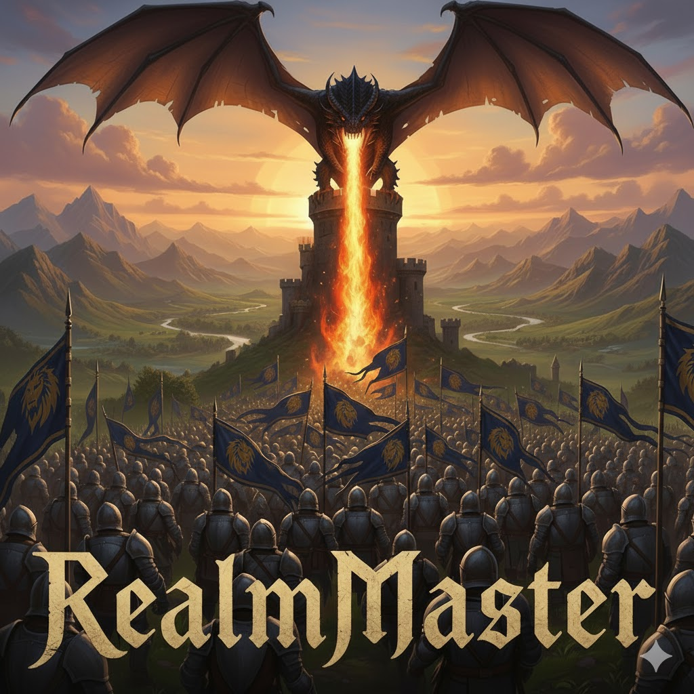

<div align="center">
  
</div>

# AzerothCore RealmMaster

A complete containerized deployment of AzerothCore WoW 3.3.5a (Wrath of the Lich King) private server with **hundreds** of supported modules and intelligent automations to allow for easy setup, deployment and management.

## Table of Contents

- [Quick Start](#quick-start)
- [What You Get](#what-you-get)
- [Getting Started](#getting-started) → **[docs/GETTING_STARTED.md](docs/GETTING_STARTED.md)**
- [Complete Module Catalog](#complete-module-catalog) → **[docs/MODULES.md](docs/MODULES.md)**
- [Management & Operations](#management--operations) → **[docs/GETTING_STARTED.md](docs/GETTING_STARTED.md)**
- [Advanced Configuration](#advanced-configuration) → **[docs/ADVANCED.md](docs/ADVANCED.md)**
- [Custom NPCs Guide](#custom-npcs-guide) → **[docs/NPCS.md](docs/NPCS.md)**
- [Script Reference](#script-reference) → **[docs/SCRIPTS.md](docs/SCRIPTS.md)**
- [Troubleshooting](#troubleshooting) → **[docs/TROUBLESHOOTING.md](docs/TROUBLESHOOTING.md)**
- [Credits & Next Steps](#credits--next-steps)

---

## Quick Start

### Reccomendations
- **Docker** with Docker Compose 2
- **16GB+ RAM** and **64GB+ storage**
- **Linux/macOS/WSL2** Fully tested with Ubuntu 24.04 and Debian 12

### Three Simple Steps

```bash
# 1. Get the code
git clone https://github.com/uprightbass360/AzerothCore-RealmMaster.git
cd AzerothCore-RealmMaster

# 2. Configure your server
./setup.sh

# 3. Deploy 
./deploy.sh   # Always required - Supports ssh remote deploy or local
./status.sh   # Optional - Shows health and accesibility of all containers and current user data
```

**First deployment takes 30-60 minutes** for database setup and client data download. Subsequent starts are much faster.

See [Getting Started](#getting-started) for detailed walkthrough.

## What You Get

### ✅ Core Server Components
- **AzerothCore 3.3.5a** - WotLK server application with 348 modules in the manifest (221 currently supported)
- **MySQL 8.0** - Database with intelligent initialization and restoration
- **Smart Module System** - Automated module management and source builds
- **phpMyAdmin** - Web-based database administration
- **Keira3** - Game content editor and developer tools

### ✅ Automated Configuration
- **Intelligent Database Setup** - Smart backup detection, restoration, and conditional schema import (details in [docs/DATABASE_MANAGEMENT.md](docs/DATABASE_MANAGEMENT.md))
- **Restore-Aware Backups & SQL** - Restore-aware SQL staging and snapshot safety checks keep modules in sync after restores ([docs/DATABASE_MANAGEMENT.md](docs/DATABASE_MANAGEMENT.md))
- **Module Integration** - Automatic source builds when C++ modules are enabled
- **Service Orchestration** - Profile-based deployment (standard/playerbots/modules)

---

## Getting Started

**Quick Overview:**
1. Clone repository → `./setup.sh` → `./build.sh` (if needed) → `./deploy.sh`
2. Create admin account and connect your WoW 3.3.5a client
3. Access management tools at http://localhost:8081 (phpMyAdmin) and http://localhost:4201 (Keira3)

For complete local and remote deployment guides, see **[docs/GETTING_STARTED.md](docs/GETTING_STARTED.md)**.

---

## Complete Module Catalog

Choose from **hundreds of enhanced modules** spanning automation, quality-of-life improvements, gameplay enhancements, PvP features, and more. The manifest contains 348 modules (221 marked supported/active); the default RealmMaster preset enables 33 that are exercised in testing. All modules are automatically downloaded, configured, and integrated during deployment when selected.

Want a shortcut? Use a preset (`RealmMaster`, `suggested-modules`, `playerbots-suggested-modules`, `azerothcore-vanilla`, `playerbots-only`, `all-modules`) from `config/module-profiles/`—see [docs/GETTING_STARTED.md#module-presets](docs/GETTING_STARTED.md#module-presets).

**Popular Categories:**
- **Automation** - Playerbots, AI chat, level management
- **Quality of Life** - Solo LFG, AOE looting, auto-revive
- **Gameplay** - Autobalance, challenge modes, hardcore mode
- **Services** - Transmog, profession NPCs, talent templates

Browse the complete catalog with descriptions at **[docs/MODULES.md](docs/MODULES.md)**.

---

## Custom NPCs Guide

The server includes **14 custom NPCs** spanning services, buffs, PvP, and guild support. Full spawn commands, coordinates, and functions are in **[docs/NPCS.md](docs/NPCS.md)**.

---

## Management & Operations

For common workflows, management commands, and database operations, see **[docs/GETTING_STARTED.md](docs/GETTING_STARTED.md)**. For script details (including module manifest auto-sync), see **[docs/SCRIPTS.md](docs/SCRIPTS.md)**.

---

## Advanced Configuration

For architecture details, storage structure, build system, and advanced customization, see **[docs/ADVANCED.md](docs/ADVANCED.md)**.


---


## Script Reference

For comprehensive documentation of all deployment scripts, management commands, and automation tools, see **[docs/SCRIPTS.md](docs/SCRIPTS.md)**.

---

## Troubleshooting

For diagnostic procedures, common issues, and backup system documentation, see **[docs/TROUBLESHOOTING.md](docs/TROUBLESHOOTING.md)**.

---

## Credits & Next Steps

### Project Credits

This project builds upon:
- **[AzerothCore](https://github.com/azerothcore/azerothcore-wotlk)** - Core server application
- **[AzerothCore Module Community](https://github.com/azerothcore)** - Enhanced gameplay modules

#### Key Features
- ✅ **Fully Automated Setup** - Interactive configuration and deployment
- ✅ **Intelligent Module System** - Automatic source builds and profile selection
- ✅ **Automated Backups** - Health checks, scheduled backups, and monitoring
- ✅ **Docker-Based** - Containerized deployment for easy setup and portability
- ✅ **Comprehensive Documentation** - Clear setup and troubleshooting guides

### Next Steps After Installation
**For detailed server administration, monitoring, backup configuration, and performance tuning, see [docs/GETTING_STARTED.md](docs/GETTING_STARTED.md).**

- **Create admin account** - Attach to worldserver and create a GM user (commands in **[docs/GETTING_STARTED.md#post-installation-steps](docs/GETTING_STARTED.md#post-installation-steps)**).
- **Point your client** - Update `realmlist.wtf` to your host/ports (defaults in the same section above).
- **Open services** - phpMyAdmin and Keira3 URLs/ports are listed in **[docs/GETTING_STARTED.md#post-installation-steps](docs/GETTING_STARTED.md#post-installation-steps)**.
