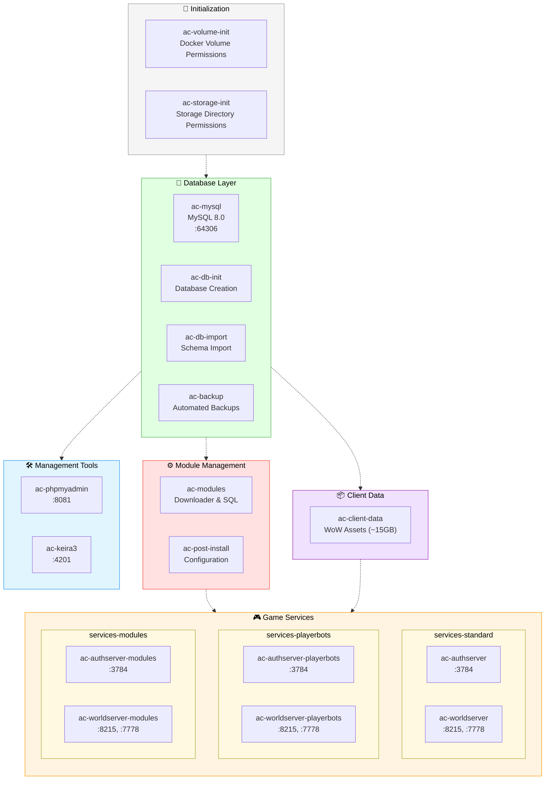

# Advanced Configuration

## Table of Contents

- [Architecture Overview](#architecture-overview)
  - [Container Profiles](#container-profiles)
  - [Service Inventory & Ports](#service-inventory--ports)
- [Database Hardening](#database-hardening)
- [Compose Overrides](#compose-overrides)
- [Storage Structure](#storage-structure)
- [Build System](#build-system)
- [Custom Configuration](#custom-configuration)

---

This document provides technical details for advanced users and system administrators working with AzerothCore RealmMaster. It covers the internal architecture, configuration options, and customization capabilities for specialized deployments and development environments.

## Architecture Overview

### Container Profiles



**Profile Notes:**
- **Initialization**: Auto-runs, no profile needed
- **Database Layer**: `profile: db`
- **Client Data**: `profile: client-data` or `client-data-bots`
- **Module Management**: `profile: modules`
- **Game Services**: ONE of `services-standard`, `services-playerbots`, or `services-modules`
- **Management Tools**: `profile: tools`

### Service Inventory & Ports

| Service / Container | Role | Ports (host → container) | Profile |
|---------------------|------|--------------------------|---------|
| `ac-mysql` | MySQL 8.0 database | *(optional)* `64306 → 3306` (`COMPOSE_OVERRIDE_MYSQL_EXPOSE_ENABLED=1`) | `db` |
| `ac-db-init` | Database schema initialization | – | `db` |
| `ac-db-import` | Database content import | – | `db` |
| `ac-backup` | Automated backup system | – | `db` |
| `ac-authserver` | Auth server (standard) | `3784 → 3724` | `services-standard` |
| `ac-worldserver` | World server (standard) | `8215 → 8085`, `7778 → 7878` | `services-standard` |
| `ac-authserver-playerbots` | Playerbots auth | `3784 → 3724` | `services-playerbots` |
| `ac-worldserver-playerbots` | Playerbots world | `8215 → 8085`, `7778 → 7878` | `services-playerbots` |
| `ac-authserver-modules` | Custom build auth | `3784 → 3724` | `services-modules` |
| `ac-worldserver-modules` | Custom build world | `8215 → 8085`, `7778 → 7878` | `services-modules` |
| `ac-client-data` | Client data fetcher | – | `client-data` |
| `ac-modules` | Module manager | – | `modules` |
| `ac-post-install` | Post-installation configuration | – | Auto-start |
| `ac-phpmyadmin` | Database admin UI | `8081 → 80` | `tools` |
| `ac-keira3` | Game content editor | `4201 → 8080` | `tools` |

## Database Hardening

- **MySQL port exposure** – By default `COMPOSE_OVERRIDE_MYSQL_EXPOSE_ENABLED=0`, so `ac-mysql` is reachable only from the internal Docker network. Set it to `1` to publish `${MYSQL_EXTERNAL_PORT}` on the host; RealmMaster scripts automatically include `compose-overrides/mysql-expose.yml` so the override Just Works. If you invoke Compose manually, remember to add `-f compose-overrides/mysql-expose.yml`. You can follow the same `COMPOSE_OVERRIDE_<NAME>_ENABLED=1` pattern for any custom override files you drop into `compose-overrides/`.
- **Worldserver debug logging** – Need extra verbosity temporarily? Flip `COMPOSE_OVERRIDE_WORLDSERVER_DEBUG_LOGGING_ENABLED=1` to include `compose-overrides/worldserver-debug-logging.yml`, which bumps `AC_LOG_LEVEL` across all worldserver profiles. Turn it back off once you're done to avoid noisy logs.
- **Binary logging toggle** – `MYSQL_DISABLE_BINLOG=1` appends `--skip-log-bin` via the MySQL wrapper entrypoint to keep disk churn low (and match Playerbot guidance). Flip the flag to `0` to re-enable binlogs for debugging or replication.
- **Drop-in configs** – Any `.cnf` placed in `${STORAGE_PATH}/config/mysql/conf.d` (exposed via `MYSQL_CONFIG_DIR`) is mounted into `/etc/mysql/conf.d`. Use this to add custom tunables or temporarily override the binlog setting without touching the image.

## Compose Overrides

All helper scripts automatically include any override file found in `compose-overrides/` when its matching flag `COMPOSE_OVERRIDE_<NAME>_ENABLED` is set to `1` in `.env`. Each override declares its flag at the top with `# override-flag: ...`. This lets you ship opt-in tweaks without editing `docker-compose.yml`.

Current examples:

- `compose-overrides/mysql-expose.yml` (`COMPOSE_OVERRIDE_MYSQL_EXPOSE_ENABLED`) – Publishes MySQL to `${MYSQL_EXTERNAL_PORT}` for external clients.
- `compose-overrides/worldserver-debug-logging.yml` (`COMPOSE_OVERRIDE_WORLDSERVER_DEBUG_LOGGING_ENABLED`) – Raises `AC_LOG_LEVEL` to `3` across all worldserver profiles for troubleshooting.

Add your own override by dropping a new `.yml` file into `compose-overrides/`, documenting the flag name in a comment, and toggling that flag in `.env`.

## Storage Structure

The project uses a dual-storage approach for optimal performance:

**Primary Storage** (`STORAGE_PATH` - default: NFS mount or shared storage)
```
storage/
├── config/               # Server configuration files (.conf)
│   └── mysql/
│       └── conf.d/       # Drop-in MySQL overrides (mapped to /etc/mysql/conf.d)
├── client-data/          # Unpacked WoW client data & DBC overrides
├── logs/                 # Server log files
├── modules/              # Downloaded module source code
├── lua_scripts/          # Eluna Lua scripts (auto-loaded)
├── install-markers/      # Module installation state tracking
└── backups/              # Automated database backups
    ├── daily/        # Daily backups (retained per BACKUP_RETENTION_DAYS)
    └── hourly/       # Hourly backups (retained per BACKUP_RETENTION_HOURS)
```

`storage/client-data` is bind-mounted into every world/auth/client-data container. Drop patched `dbc`, `maps`, `vmaps`, or `mmaps` files directly into that folder (e.g., `storage/client-data/dbc/SkillLine.dbc`) and the containers will read them immediately—perfect for modules like Individual Progression or mod-worgoblin that need to overwrite Blizzard data.

Need to capture more than the default `auth/world/characters` schemas? Set `BACKUP_EXTRA_DATABASES` in `.env` (comma or space separated) and the `ac-backup` scheduler will validate each schema before adding it to the hourly/daily dump rotation. The long-standing auto-detection for `acore_playerbots` still works, and any missing optional schemas are logged and skipped instead of breaking the backup run.

To tweak MySQL settings, place `.cnf` snippets in `storage/config/mysql/conf.d`. Files in this directory map straight to `/etc/mysql/conf.d` inside `ac-mysql`, so you can re-enable binary logs or tune buffers without rebuilding images.

**Local Storage** (`STORAGE_PATH_LOCAL` - default: `./local-storage`)
```
local-storage/
├── mysql-data/           # MySQL persistent data (tmpfs runtime + persistent snapshot)
├── client-data-cache/    # Downloaded WoW client data archives
├── source/               # AzerothCore source repository (created during builds)
│   └── azerothcore-playerbots/  # Playerbot fork (when playerbots enabled)
└── images/               # Exported Docker images for remote deployment
```

**Docker Volume**
- `client-data-cache` - Temporary storage for client data downloads

This separation ensures database and build artifacts stay on fast local storage while configuration, modules, and backups can be shared across hosts via NFS.

## Build System
The build system is optimized for development and production deployments with Docker multi-stage builds and caching.

**Build Configuration:**
- Automated dependency resolution and compilation
- Multi-stage Docker builds for optimal image sizes
- Build artifact caching for faster rebuilds
- Support for custom patches and modifications

## Custom Configuration
Advanced customization options for specialized deployments and development environments.

**Configuration Options:**
- Environment-specific overrides in `docker-compose.override.yml`
- Custom module loading and configuration
- Database schema modifications and patches
- Network and security configuration

---

## Related Documentation

For additional information, see the following documents:

- [Getting Started Guide](GETTING_STARTED.md) - Basic setup and deployment
- [Module Documentation](MODULES.md) - Complete module catalog and configurations
- [Script Reference](SCRIPTS.md) - Detailed script documentation and usage
- [Main README](../README.md) - Project overview and quick start guide

---

*This documentation is part of the AzerothCore RealmMaster project. For updates and contributions, visit the main project repository.*
