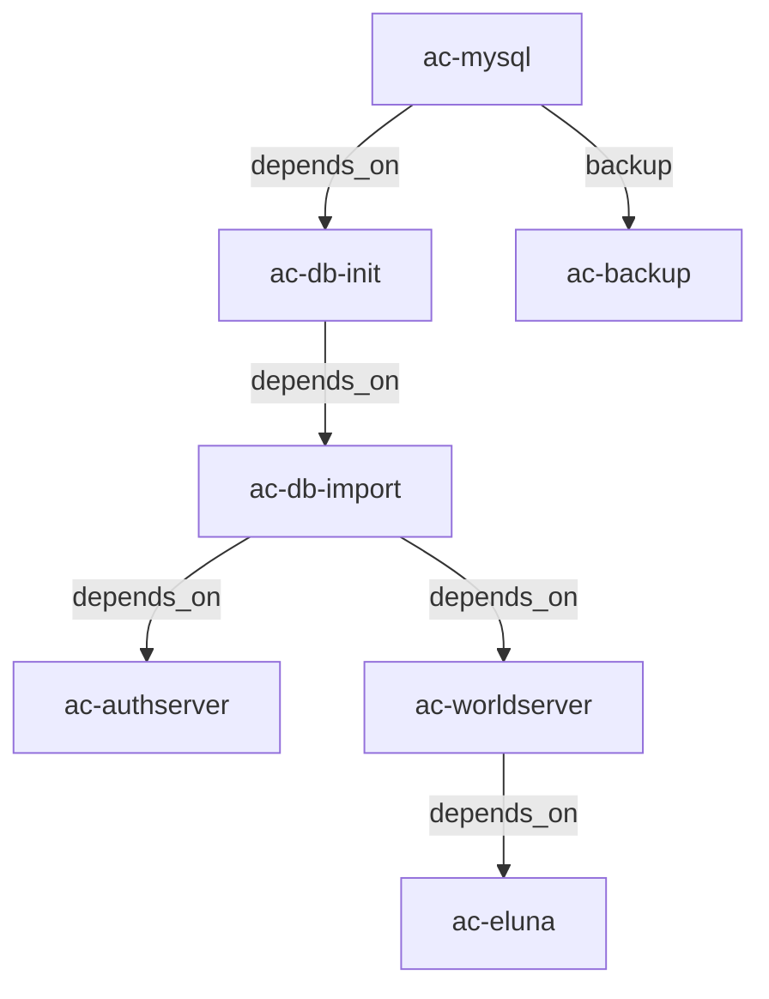

# AzerothCore Docker/Podman Stack

A complete containerized deployment of AzerothCore WoW 3.3.5a (Wrath of the Lich King) private server with Playerbot functionality, Eluna scripting, and automated management features.

## Implementation Credits

This project is a Docker/Podman implementation based on:
- **[AzerothCore](https://github.com/azerothcore/azerothcore-wotlk)** - The open-source MMORPG server application for World of Warcraft
- **[AzerothCore with Playerbots Docker Setup](https://github.com/coc0nut/AzerothCore-with-Playerbots-Docker-Setup)** - Docker configuration inspiration and Playerbot integration approach

### Key Improvements in This Implementation
- **Logger Issue Resolution**: Fixed worldserver startup issues with proper logger configuration
- **Dynamic URL Generation**: Web interfaces automatically detect external URLs for deployment flexibility
- **Port Collision Prevention**: All external ports optimized to avoid common development tool conflicts
- **Enhanced Security**: Comprehensive security settings for all web interfaces (Grafana, InfluxDB, PHPMyAdmin)
- **Full Environment Variable Configuration**: No hardcoded values, everything configurable via .env
- **External Domain Support**: Configurable base URLs for custom domain deployment
- **Multi-Runtime Support**: Works with both Docker and Podman
- **Automated Database Initialization**: Complete schema import and setup automation
- **Comprehensive Health Checks**: Built-in service monitoring and restart policies
- **Automated Backup System**: Scheduled backups with configurable retention
- **Production-Ready Security**: Advanced security configurations and best practices

## Table of Contents
- [Overview](#overview)
- [Features](#features)
- [Requirements](#requirements)
- [Project Structure](#project-structure)
- [Container Architecture](#container-architecture)
- [Initial Setup](#initial-setup)
- [Configuration](#configuration)
- [Volume Management](#volume-management)
- [Maintenance](#maintenance)
- [Troubleshooting](#troubleshooting)
- [Security Considerations](#security-considerations)

## Overview

This project provides a production-ready AzerothCore deployment using Docker/Podman containers, building upon the foundational work of the [AzerothCore project](https://github.com/azerothcore/azerothcore-wotlk) and incorporating containerization patterns from [coc0nut's Docker setup](https://github.com/coc0nut/AzerothCore-with-Playerbots-Docker-Setup).

### What This Implementation Provides
- **Enhanced Configuration**: All settings externalized to environment variables
- **Container Runtime Flexibility**: Works with both Docker and Podman
- **Production Features**: Health checks, automated backups, log management
- **Improved Security**: No hardcoded passwords, configurable network isolation
- **Operational Tools**: Comprehensive maintenance scripts and troubleshooting guides
- **Full Documentation**: Complete setup, configuration, and maintenance procedures

### Core Components
- Automated database initialization and imports
- Playerbot support for solo play (using [liyunfan1223's mod-playerbots](https://github.com/liyunfan1223/mod-playerbots))
- Eluna Lua scripting engine
- Automated backups
- Full configuration through environment variables
- Support for both Docker and Podman runtimes
- Portainer compatibility

### Version Information
- **AzerothCore**: 3.3.5a (master branch) from [azerothcore/azerothcore-wotlk](https://github.com/azerothcore/azerothcore-wotlk)
- **Playerbot Module**: [liyunfan1223/mod-playerbots](https://github.com/liyunfan1223/mod-playerbots)
- **MySQL**: 8.0
- **Game Client**: World of Warcraft 3.3.5a (Build 12340)
- **Base Images**: Official AzerothCore Docker images

## Features

- ✅ **Fully Containerized**: All components run in isolated containers
- ✅ **Automated Setup**: Database creation, schema import, and configuration handled automatically
- ✅ **Playerbot Integration**: AI-controlled bots for solo/small group play
- ✅ **Eluna Support**: Lua scripting for custom content
- ✅ **Automated Backups**: Scheduled database backups with retention policies
- ✅ **Environment-Based Config**: All settings configurable via .env file
- ✅ **Health Monitoring**: Built-in health checks for all services
- ✅ **Network Isolation**: Custom bridge network for container communication
- ✅ **Persistent Storage**: Named volumes for data persistence

## Requirements

### System Requirements
- **OS**: Linux (Ubuntu 20.04+, Debian 11+, RHEL 8+, or similar)
- **RAM**: Minimum 4GB, Recommended 8GB+
- **Storage**: 20GB minimum (50GB+ recommended with client data)
- **CPU**: 2+ cores recommended
- **Network**: Static IP recommended for external access

### Software Requirements
- **Container Runtime**: Docker 20.10+ OR Podman 3.0+
- **Compose Tool**: docker-compose 1.29+ OR podman-compose 1.0+
- **MySQL Client**: For manual database operations (optional)
- **Git**: For cloning repositories (optional)

### Game Client Requirements
- **WoW Client**: Version 3.3.5a (Build 12340)
- **Client Data**: Extracted maps, vmaps, mmaps, and DBC files

## Project Structure

```
azerothcore-docker/
├── docker-compose.yml      # Main orchestration file
├── .env                    # Environment configuration (create from .env.example)
├── data/                   # Game data files (maps, vmaps, etc.)
│   ├── dbc/               # Client database files
│   ├── maps/              # Map files
│   ├── vmaps/             # Visual map files
│   └── mmaps/             # Movement map files (optional)
├── backups/               # Automated backup storage
└── logs/                  # Application logs
```

## Container Architecture

### Service Containers

| Container | Image | Purpose | Exposed Ports | Status |
|-----------|-------|---------|---------------|---------|
| `ac-mysql` | mysql:8.0 | MySQL database server | 64306:3306 | ✅ Healthy |
| `ac-authserver` | acore/ac-wotlk-authserver:14.0.0-dev | Authentication server | 3784:3724 | ⚠️ Running (unhealthy) |
| `ac-worldserver` | acore/ac-wotlk-worldserver:14.0.0-dev | Game world server | 8215:8085, 7778:7878 | ⚠️ Running (unhealthy) |
| `ac-eluna` | acore/eluna-ts:master | Lua scripting engine | - | 🔄 Restarting |
| `ac-phpmyadmin` | phpmyadmin/phpmyadmin:latest | Database management web UI | 8081:80 | ✅ Running |
| `ac-grafana` | grafana/grafana:latest | Monitoring dashboard | 3001:3000 | ✅ Running |
| `ac-influxdb` | influxdb:2.7-alpine | Metrics database | 8087:8086 | ✅ Running |
| `ac-keira3` | keira3:latest | Production database editor | 4201:8080 | ✅ Running (healthy) |
| `ac-backup` | mysql:8.0 | Automated backup service | - | ✅ Running |
| `ac-modules` | alpine/git:latest | Module management | - | ✅ Running |

### Container Relationships



### Network Architecture
- **Network Name**: `azerothcore`
- **Type**: Bridge network
- **Subnet**: 172.28.0.0/16 (configurable)
- **Internal DNS**: Container names resolve to IPs

## Initial Setup

### Step 1: Prepare Environment File

```bash
# Create project directory
mkdir -p /opt/azerothcore-docker
cd /opt/azerothcore-docker

# Create .env file with your configuration
# Copy the provided .env template and modify:
# - EXTERNAL_IP: Your server's public IP
# - MYSQL_ROOT_PASSWORD: Strong password
# - HOST_*_PATH: Adjust paths as needed
```

### Step 2: Prepare Game Data Files

The server requires extracted game data from the WoW 3.3.5a client:

```bash
# Create data directory structure
mkdir -p data/{dbc,maps,vmaps,mmaps}

# Option A: Copy from existing extraction
cp -r /path/to/extracted/dbc/* data/dbc/
cp -r /path/to/extracted/maps/* data/maps/
cp -r /path/to/extracted/vmaps/* data/vmaps/
cp -r /path/to/extracted/mmaps/* data/mmaps/  # Optional

# Option B: Extract from WoW client
# Use AzerothCore extraction tools on your WoW 3.3.5a client
```

### Step 3: Deploy the Stack

#### Using Docker Compose:
```bash
# Deploy all services
docker-compose up -d

# Monitor deployment
docker-compose logs -f

# Verify all containers are running
docker ps | grep ac-
```

#### Using Podman Compose:
```bash
# Install podman-compose if needed
pip3 install podman-compose

# Deploy all services
podman-compose up -d

# Monitor deployment
podman-compose logs -f

# Verify all containers are running
podman ps | grep ac-
```

### Step 4: Initial Database Import

The database import happens automatically via the `ac-db-import` container. Monitor progress:

```bash
# Check import status
docker logs ac-db-import -f

# Verify databases were created
docker exec ac-mysql mysql -uroot -p${MYSQL_ROOT_PASSWORD} -e "SHOW DATABASES;"
```

### Step 5: Create Admin Account

Once the worldserver is running:

```bash
# Attach to worldserver console
docker attach ac-worldserver

# In the worldserver console, create admin account:
account create admin yourpassword
account set gmlevel admin 3 -1
server info

# Detach from console without stopping: Ctrl+P, Ctrl+Q
```

### Step 6: Configure Game Client

Edit your WoW 3.3.5a client's `realmlist.wtf`:
```
set realmlist YOUR_SERVER_IP
```

## Configuration

### Environment Variables

All configuration is managed through the `.env` file. Key variables:

#### Database Settings
- `MYSQL_ROOT_PASSWORD`: Database root password
- `MYSQL_HOST`: Database hostname (default: ac-mysql)
- `DB_AUTH_NAME`: Authentication database name
- `DB_WORLD_NAME`: World database name
- `DB_CHARACTERS_NAME`: Characters database name

#### Network Settings
- `EXTERNAL_IP`: Public IP for realm list
- `EXTERNAL_BASE_URL`: Custom domain URL (e.g., https://acore.example.com)
- `DOCKER_AUTH_EXTERNAL_PORT`: Auth server external port (3784)
- `DOCKER_WORLD_EXTERNAL_PORT`: World server external port (8215)
- `DOCKER_SOAP_EXTERNAL_PORT`: SOAP API port (7778)

#### Web Interface Settings (Collision-Free Ports)
- `PMA_EXTERNAL_PORT`: PHPMyAdmin port (8081)
- `KEIRA3_EXTERNAL_PORT`: Database editor port (4201)
- `GF_EXTERNAL_PORT`: Grafana monitoring port (3001)
- `INFLUXDB_EXTERNAL_PORT`: InfluxDB metrics port (8087)

#### Performance Settings
- `MAX_PLAYERS`: Maximum concurrent players
- `PROCESS_PRIORITY`: Process priority level
- `MAX_CONNECTIONS`: MySQL max connections

#### Game Rates
- `RATE_XP_KILL`: Experience from kills multiplier
- `RATE_XP_QUEST`: Experience from quests multiplier
- `RATE_DROP_MONEY`: Money drop rate multiplier
- `RATE_DROP_ITEMS`: Item drop rate multiplier

### Realm Configuration

Update realm settings in the database:

```bash
# Update realm IP address
docker exec ac-mysql mysql -uroot -p${MYSQL_ROOT_PASSWORD} -e "
USE acore_auth;
UPDATE realmlist SET address='NEW_IP' WHERE id=1;"

# View current realm configuration
docker exec ac-mysql mysql -uroot -p${MYSQL_ROOT_PASSWORD} -e "
USE acore_auth;
SELECT * FROM realmlist;"
```

## Volume Management

### Named Volumes

| Volume Name | Container Mount | Purpose | Can Be Bind Mounted |
|-------------|-----------------|---------|---------------------|
| `ac_mysql_data` | `/var/lib/mysql` | MySQL database files | ✅ Yes - For backup/migration |
| `ac_data` | `/azerothcore/data` | Game data (maps, vmaps, etc.) | ✅ Yes - Required for data files |
| `ac_config` | `/azerothcore/env/dist/etc` | Configuration files | ✅ Yes - For custom configs |
| `ac_logs` | `/azerothcore/logs` | Application logs | ✅ Yes - For log analysis |
| `ac_backup` | `/backups` | Database backups | ✅ Yes - For external backup storage |

### Bind Mount Examples

To use bind mounts instead of named volumes, modify the compose file:

```yaml
volumes:
  # Replace named volume with bind mount
  - /srv/azerothcore/mysql:/var/lib/mysql
  - /srv/azerothcore/data:/azerothcore/data
  - /srv/azerothcore/config:/azerothcore/env/dist/etc
  - /srv/azerothcore/logs:/azerothcore/logs
  - /srv/azerothcore/backups:/backups
```

### Volume Backup Procedures

#### Backup MySQL Data:
```bash
# Create backup of MySQL volume
docker run --rm \
  -v ac_mysql_data:/data \
  -v $(pwd):/backup \
  alpine tar czf /backup/mysql-backup-$(date +%Y%m%d).tar.gz -C /data .
```

#### Backup Game Data:
```bash
# Create backup of game data volume
docker run --rm \
  -v ac_data:/data \
  -v $(pwd):/backup \
  alpine tar czf /backup/gamedata-backup-$(date +%Y%m%d).tar.gz -C /data .
```

## Maintenance

### Daily Operations

#### Check Service Status:
```bash
# View all AzerothCore containers
docker ps | grep ac-

# Check resource usage
docker stats $(docker ps --format "{{.Names}}" | grep ac-)

# View recent logs
docker logs ac-worldserver --tail 100
docker logs ac-authserver --tail 100
```

#### Server Commands:
```bash
# Attach to worldserver console
docker attach ac-worldserver

# Common console commands:
server info                    # Show server status
account create USER PASS       # Create new account
account set gmlevel USER 3 -1 # Set GM level
server shutdown 60             # Shutdown in 60 seconds
saveall                       # Save all characters
```

### Database Maintenance

#### Manual Backup:
```bash
# Full database backup
docker exec ac-mysql mysqldump \
  -uroot -p${MYSQL_ROOT_PASSWORD} \
  --all-databases \
  --single-transaction \
  --routines \
  --triggers \
  > backup-$(date +%Y%m%d-%H%M%S).sql
```

#### Restore Backup:
```bash
# Restore from backup
docker exec -i ac-mysql mysql \
  -uroot -p${MYSQL_ROOT_PASSWORD} \
  < backup-file.sql
```

#### Database Optimization:
```bash
# Optimize all tables
docker exec ac-mysql mysqlcheck \
  -uroot -p${MYSQL_ROOT_PASSWORD} \
  --all-databases \
  --optimize
```

### Container Updates

#### Update Containers:
```bash
# Pull latest images
docker-compose pull

# Recreate containers with new images
docker-compose up -d --force-recreate

# Remove old unused images
docker image prune -a
```

#### Update AzerothCore:
```bash
# Stop services
docker-compose stop ac-worldserver ac-authserver

# Update database
docker-compose up ac-db-import

# Restart services
docker-compose start ac-worldserver ac-authserver
```

### Log Management

#### View Logs:
```bash
# Follow worldserver logs
docker logs -f ac-worldserver

# Export logs to file
docker logs ac-worldserver > worldserver.log 2>&1

# Clear old logs (if using bind mount)
find /srv/azerothcore/logs -name "*.log" -mtime +30 -delete
```

#### Log Rotation (using bind mount):
```bash
# Create logrotate config
cat > /etc/logrotate.d/azerothcore <<EOF
/srv/azerothcore/logs/*.log {
    daily
    rotate 7
    compress
    delaycompress
    missingok
    notifempty
}
EOF
```

### Automated Backups

The `ac-backup` container provides automated backups. Configure via environment:

- `BACKUP_CRON_SCHEDULE`: Cron expression (default: "0 3 * * *" - 3 AM daily)
- `BACKUP_RETENTION_DAYS`: Days to keep backups (default: 7)

#### Manual Backup Trigger:
```bash
# Execute backup immediately
docker exec ac-backup /backup.sh
```

## Troubleshooting

### Common Issues

#### 1. Worldserver Won't Start
**Error**: "Failed to find map files for starting areas"

**Solution**: Ensure game data files are properly extracted and placed in the data volume:
```bash
# Check if data files exist
docker run --rm -v ac_data:/data alpine ls -la /data/

# Should see: dbc/, maps/, vmaps/, mmaps/ directories
```

#### 2. Cannot Connect to Realm
**Error**: Realm list shows but cannot enter world

**Solution**: Update realm IP address:
```bash
docker exec ac-mysql mysql -uroot -p${MYSQL_ROOT_PASSWORD} -e "
USE acore_auth;
UPDATE realmlist SET address='YOUR_PUBLIC_IP' WHERE id=1;"
```

#### 3. Database Connection Failed
**Error**: "Can't connect to MySQL server"

**Solution**: Check MySQL container and credentials:
```bash
# Verify MySQL is running
docker ps | grep ac-mysql

# Test connection
docker exec ac-authserver ping ac-mysql

# Check MySQL logs
docker logs ac-mysql --tail 50
```

#### 4. Permission Denied Errors
**Error**: Various permission denied messages

**Solution**: Run containers as root (configured in .env):
```bash
DOCKER_USER=root
```

### Debug Commands

```bash
# Check container health
docker inspect ac-mysql | grep -A 10 "Health"

# View network configuration
docker network inspect azerothcore

# Check volume mounts
docker inspect ac-worldserver | grep -A 10 "Mounts"

# Test database connectivity
docker exec ac-mysql mysql -uroot -p${MYSQL_ROOT_PASSWORD} -e "STATUS;"

# View process list in container
docker top ac-worldserver

# Execute commands in container
docker exec ac-worldserver ls -la /azerothcore/data/
```

### Reset Procedures

#### Complete Reset:
```bash
# Stop all containers
docker-compose down

# Remove all volumes (WARNING: Deletes all data)
docker-compose down -v

# Remove all containers and images
docker system prune -a

# Start fresh
docker-compose up -d
```

#### Reset Specific Service:
```bash
# Reset worldserver only
docker-compose stop ac-worldserver
docker-compose rm -f ac-worldserver
docker-compose up -d ac-worldserver
```

## Security Considerations

### Best Practices

1. **Strong Passwords**
   - Use complex passwords for MySQL root
   - Avoid default passwords for game accounts
   - Regularly rotate admin credentials

2. **Network Security**
   - Use firewall rules to restrict access
   - Consider VPN for admin access
   - Disable SOAP if not needed

3. **File Permissions**
   - Restrict access to .env file: `chmod 600 .env`
   - Secure backup directories
   - Use non-root user when possible

4. **Regular Updates**
   - Keep containers updated
   - Apply security patches promptly
   - Monitor security advisories

### Firewall Configuration

```bash
# Allow only necessary ports
ufw allow 3784/tcp  # Auth server
ufw allow 8215/tcp  # World server
ufw allow 22/tcp    # SSH (restrict source IP)
ufw enable
```

### Monitoring

```bash
# Monitor connection attempts
docker logs ac-authserver | grep -i "failed"

# Check for unusual database queries
docker exec ac-mysql mysql -uroot -p${MYSQL_ROOT_PASSWORD} -e "
SHOW PROCESSLIST;"

# Monitor resource usage
docker stats --no-stream
```

## Support and Resources

### Official Documentation
- **[AzerothCore Wiki](https://www.azerothcore.org/)** - Official documentation
- **[AzerothCore GitHub](https://github.com/azerothcore/azerothcore-wotlk)** - Source code and issues
- **[AzerothCore Docker](https://github.com/azerothcore/acore-docker)** - Official Docker images
- **[Playerbot Documentation](https://github.com/liyunfan1223/mod-playerbots/wiki)** - Playerbot module wiki
- **[Docker Documentation](https://docs.docker.com/)** - Docker reference
- **[Podman Documentation](https://docs.podman.io/)** - Podman reference

### Community Resources
- **[AzerothCore Discord](https://discord.gg/azerothcore)** - Community support
- **[AzerothCore Forums](https://github.com/azerothcore/azerothcore-wotlk/discussions)** - Discussions
- **[ChromieCraft](https://www.chromiecraft.com/)** - AzerothCore-based progressive server

## Available Services

| Service | Endpoint | Port | Purpose |
|---------|----------|------|---------|
| **Game Server** | `localhost:8215` | 8215 | World server (game connection) |
| **Auth Server** | `localhost:3784` | 3784 | Authentication server |
| **SOAP API** | `localhost:7778` | 7778 | Server administration API |
| **PHPMyAdmin** | `http://localhost:8081` | 8081 | Database management interface |
| **Keira3** | `http://localhost:4201` | 4201 | Database editor web UI |
| **Grafana** | `http://localhost:3001` | 3001 | Monitoring dashboard |
| **InfluxDB** | `localhost:8087` | 8087 | Metrics database |
| **MySQL** | `localhost:64306` | 64306 | Direct database access |

### Database Credentials
- **Host**: `localhost:64306`
- **User**: `root`
- **Password**: `azerothcore123` (configurable in .env)
- **Databases**: `acore_auth`, `acore_world`, `acore_characters`

### Related Projects
- **[Original Docker Setup](https://github.com/coc0nut/AzerothCore-with-Playerbots-Docker-Setup)** - Base Docker configuration this project extends
- **[AzerothCore Modules](https://github.com/azerothcore/mod-repo-list)** - Additional modules catalog
- **[AC-Web](https://github.com/azerothcore/acore-cms)** - Web CMS for AzerothCore

### Useful Commands Reference
```bash
# Quick status check
docker-compose ps

# Restart all services
docker-compose restart

# View all logs
docker-compose logs

# Stop everything
docker-compose stop

# Start everything
docker-compose start

# Update and restart
docker-compose pull && docker-compose up -d

# Backup database
docker exec ac-mysql mysqldump -uroot -p${MYSQL_ROOT_PASSWORD} --all-databases > backup.sql

# Connect to worldserver console
docker attach ac-worldserver
```

## License and Attribution

### Project Licenses
- **AzerothCore**: Licensed under [AGPL-3.0](https://github.com/azerothcore/azerothcore-wotlk/blob/master/LICENSE)
- **This Docker Configuration**: Provided under MIT License for the configuration files
- **Playerbot Module**: Check [mod-playerbots](https://github.com/liyunfan1223/mod-playerbots) for specific licensing

### Credits
- **[AzerothCore Team](https://github.com/azerothcore)**: For the core server application
- **[coc0nut](https://github.com/coc0nut)**: For the initial Docker setup approach with Playerbots
- **[liyunfan1223](https://github.com/liyunfan1223)**: For the Playerbot module
- **Community Contributors**: For various modules and improvements

### Legal Notice
World of Warcraft® and Blizzard Entertainment® are registered trademarks of Blizzard Entertainment, Inc. This project is not affiliated with Blizzard Entertainment.

## Contributing

Contributions are welcome! Please:
1. Fork the repository
2. Create a feature branch
3. Commit your changes
4. Push to the branch
5. Create a Pull Request

## Changelog

### Version 1.0.0 (2025)
- One-Shot yaml file which implements all inital settings
- Initial release with full containerization
- Playerbot support integrated
- Automated backup system
- Complete environment variable configuration

---

**Note**: This is an unofficial community deployment. Always backup your data before updates or changes.
