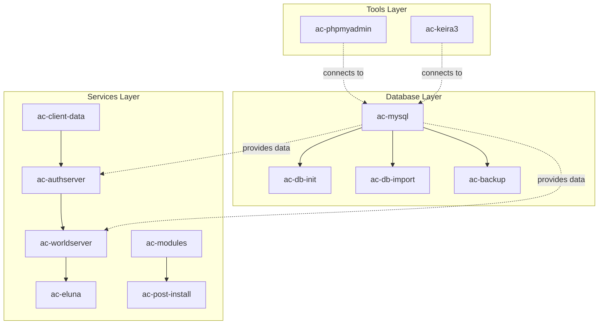

# AzerothCore Docker/Podman Stack

A complete containerized deployment of AzerothCore WoW 3.3.5a (Wrath of the Lich King) private server with Playerbot functionality, Eluna scripting, and automated management features.

## Implementation Credits

This project is a Docker/Podman implementation based on:
- **[AzerothCore](https://github.com/azerothcore/azerothcore-wotlk)** - The open-source MMORPG server application for World of Warcraft
- **[AzerothCore with Playerbots Docker Setup](https://github.com/coc0nut/AzerothCore-with-Playerbots-Docker-Setup)** - Docker configuration inspiration and Playerbot integration approach

### Key Improvements in This Implementation
- **Logger Issue Resolution**: Fixed worldserver startup issues with proper logger configuration
- **Dynamic URL Generation**: Web interfaces automatically detect external URLs for deployment flexibility
- **Port Collision Prevention**: All external ports optimized to avoid common development tool conflicts
- **Enhanced Security**: Comprehensive security settings for all web interfaces (PHPMyAdmin)
- **Full Environment Variable Configuration**: No hardcoded values, everything configurable via .env
- **External Domain Support**: Configurable base URLs for custom domain deployment
- **Multi-Runtime Support**: Works with both Docker and Podman
- **Automated Database Initialization**: Complete schema import and setup automation
- **Comprehensive Health Checks**: Built-in service monitoring and restart policies
- **Automated Service Restart**: Post-install automatically restarts services with Docker/Podman support
- **Automated Backup System**: Scheduled backups with configurable retention
- **Production-Ready Security**: Advanced security configurations and best practices

## Table of Contents
- [Overview](#overview)
- [Features](#features)
- [Requirements](#requirements)
- [Project Structure](#project-structure)
- [Container Architecture](#container-architecture)
- [Initial Setup](#initial-setup)
- [Configuration](#configuration)
- [Volume Management](#volume-management)
- [Maintenance](#maintenance)
- [Backup System](#backup-system)
- [Deployment Scripts](#deployment-scripts)
- [Troubleshooting](#troubleshooting)
- [Security Considerations](#security-considerations)
- [Available Modules](#available-modules)

## Overview

This project provides a production-ready AzerothCore deployment using Docker/Podman containers, building upon the foundational work of the [AzerothCore project](https://github.com/azerothcore/azerothcore-wotlk) and incorporating containerization patterns from [coc0nut's Docker setup](https://github.com/coc0nut/AzerothCore-with-Playerbots-Docker-Setup).

### What This Implementation Provides
- **Enhanced Configuration**: All settings externalized to environment variables
- **Container Runtime Flexibility**: Works with both Docker and Podman
- **Production Features**: Health checks, automated backups, log management
- **Improved Security**: No hardcoded passwords, configurable network isolation
- **Operational Tools**: Comprehensive maintenance scripts and troubleshooting guides
- **Full Documentation**: Complete setup, configuration, and maintenance procedures

### Core Components
- Automated database initialization and imports
- Playerbot support for solo play (using [liyunfan1223's mod-playerbots](https://github.com/liyunfan1223/mod-playerbots))
- Eluna Lua scripting engine
- Automated backups
- Full configuration through environment variables
- Support for both Docker and Podman runtimes
- Portainer compatibility

### Version Information
- **AzerothCore**: 3.3.5a (master branch) from [azerothcore/azerothcore-wotlk](https://github.com/azerothcore/azerothcore-wotlk)
- **Playerbot Module**: [liyunfan1223/mod-playerbots](https://github.com/liyunfan1223/mod-playerbots)
- **MySQL**: 8.0
- **Game Client**: World of Warcraft 3.3.5a (Build 12340)
- **Base Images**: Official AzerothCore Docker images

## Features

- ✅ **Fully Containerized**: All components run in isolated containers
- ✅ **Automated Setup**: Database creation, schema import, and configuration handled automatically
- ✅ **Auto-Restart Services**: Post-install automatically restarts authserver/worldserver (Docker/Podman compatible)
- ✅ **Playerbot Integration**: AI-controlled bots for solo/small group play
- ✅ **Eluna Support**: Lua scripting for custom content
- ✅ **Automated Backups**: Scheduled database backups with retention policies
- ✅ **Environment-Based Config**: All settings configurable via .env file
- ✅ **Health Monitoring**: Built-in health checks for all services
- ✅ **Network Isolation**: Custom bridge network for container communication
- ✅ **Persistent Storage**: Named volumes for data persistence


## Requirements

### System Requirements
- **OS**: Linux (Ubuntu 20.04+, Debian 11+, RHEL 8+, or similar)
- **RAM**: Minimum 4GB, Recommended 8GB+
- **Storage**: 20GB minimum (50GB+ recommended with client data)
- **CPU**: 2+ cores recommended
- **Network**: Static IP recommended for external access

### Software Requirements
- **Container Runtime**: Docker 20.10+ OR Podman 3.0+
- **Compose Tool**: docker-compose 1.29+ OR podman-compose 1.0+
- **MySQL Client**: For manual database operations (optional)
- **Git**: For cloning repositories (optional)

### MySQL MCP Requirements
- **Note**: To use the MySQL MCP (Model Context Protocol) with this project, the database must be running
- **Database Access**: The MySQL container must be accessible on port 64306 (configurable in environment files)
- **Connection Details**: MCP will need the database credentials configured in the environment files

### Game Client Requirements
- **WoW Client**: Version 3.3.5a (Build 12340)
- **Client Data**: Extracted maps, vmaps, mmaps, and DBC files

## Project Structure

```
acore-compose/
├── docker-compose-azerothcore-database.yml     # Database layer
├── docker-compose-azerothcore-database.env     # Database configuration
├── docker-compose-azerothcore-services.yml     # Game services layer
├── docker-compose-azerothcore-services.env     # Services configuration
├── docker-compose-azerothcore-tools.yml        # Management tools layer
├── docker-compose-azerothcore-tools.env        # Tools configuration
├── scripts/                                    # Deployment, cleanup, and backup automation
├── storage/                                    # Unified storage root (configurable via STORAGE_ROOT)
│   └── azerothcore/                            # All persistent data (database, configs, tools)
│      └── backups/                             # Database backups (see backups documentation for sub-folder listing)
└── readme.md                                   # This documentation
```

## Container Architecture

### Service Containers

| Container | Image | Purpose | Exposed Ports |
|-----------|-------|---------|---------------|
| **Database Layer** |
| `ac-mysql` | mysql:8.0 | MySQL database server | 64306:3306 |
| `ac-db-init` | mysql:8.0 | Database initialization (one-time) | - |
| `ac-db-import` | acore/ac-wotlk-db-import:14.0.0-dev | Database import (one-time) | - |
| `ac-backup` | mysql:8.0 | Automated backup service with GitHub scripts | - |
| **Services Layer** |
| `ac-client-data` | alpine:latest | Game client data download/extraction | - |
| `ac-authserver` | acore/ac-wotlk-authserver:14.0.0-dev | Authentication server | 3784:3724 |
| `ac-worldserver` | acore/ac-wotlk-worldserver:14.0.0-dev | Game world server | 8215:8085, 7778:7878 |
| `ac-eluna` | acore/eluna-ts:master | Lua scripting engine | - |
| `ac-modules` | alpine/git:latest | Module management with GitHub script download | - |
| `ac-post-install` | alpine:latest | Automatic post-installation configuration | - |
| **Tools Layer** |
| `ac-phpmyadmin` | phpmyadmin/phpmyadmin:latest | Database management web UI | 8081:80 |
| `ac-keira3` | uprightbass360/keira3:latest | Production database editor with API | 4201:8080 | 

### Container Relationships



**Layer Dependencies**:
- **Database Layer**: Independent, starts first
- **Services Layer**: Depends on database layer being ready
- **Tools Layer**: Connects to database layer externally

**Container Dependencies**:
- `ac-worldserver` depends on: `ac-authserver`, `ac-client-data`
- `ac-post-install` depends on: `ac-modules`
- All game services connect to: `ac-mysql`

### Network Architecture
- **Network Name**: `azerothcore`
- **Type**: Bridge network
- **Subnet**: 172.28.0.0/16 (configurable)
- **Internal DNS**: Container names resolve to IPs

## Initial Setup

### Quick Setup Script (Recommended)

For the easiest setup experience, use the interactive setup script:

```bash
# Clone the repository
git clone https://github.com/uprightbass360/acore-compose.git
cd acore-compose

# Run the interactive setup script
./scripts/setup-server.sh
```

The setup script will:
- ✅ **Guide you through deployment type selection** (Local, LAN, or Public server)
- ✅ **Auto-detect your network configuration** (LAN IP detection)
- ✅ **Validate all inputs** (IP addresses, ports, paths)
- ✅ **Generate custom environment files** (`*-custom.env`) with your settings
- ✅ **Provide deployment commands** tailored to your configuration
- ✅ **Show client configuration** with exact realmlist.wtf settings

**Generated Files**:
- `docker-compose-azerothcore-database-custom.env`
- `docker-compose-azerothcore-services-custom.env`
- `docker-compose-azerothcore-tools-custom.env`

**Deploy with custom configuration**:
```bash
# Database layer
docker compose --env-file docker-compose-azerothcore-database-custom.env -f docker-compose-azerothcore-database.yml up -d

# Services layer
docker compose --env-file docker-compose-azerothcore-services-custom.env -f docker-compose-azerothcore-services.yml up -d

# Tools layer (optional)
docker compose --env-file docker-compose-azerothcore-tools-custom.env -f docker-compose-azerothcore-tools.yml up -d
```

### Manual Setup

### Step 1: Clone and Configure

```bash
# Clone the repository
git clone https://github.com/uprightbass360/acore-compose.git
cd acore-compose

# Environment files are pre-configured with defaults
# Modify the relevant .env files for your deployment:
# - docker-compose-azerothcore-database.env: Database settings
# - docker-compose-azerothcore-services.env: Game server settings
# - docker-compose-azerothcore-tools.env: Management tools settings

# IMPORTANT: Configure storage location for your environment
# For local development (default):
#   STORAGE_ROOT=./storage
# For production with NFS:
#   STORAGE_ROOT=/nfs/containers
# For custom mount:
#   STORAGE_ROOT=/mnt/azerothcore-data

# IMPORTANT: Configure server address for client connections
# Edit docker-compose-azerothcore-services.env:
#   SERVER_ADDRESS=your-server-ip-or-domain
#   REALM_PORT=8215
```

### Server Address Configuration

Configure the external server address that WoW clients will use to connect:

**Environment Variables** (in `docker-compose-azerothcore-services.env`):
- `SERVER_ADDRESS`: The IP address or domain name clients use to connect
- `REALM_PORT`: The external port clients connect to (default: 8215)

**Configuration Examples**:
```bash
# Local development (single machine)
SERVER_ADDRESS=127.0.0.1
REALM_PORT=8215

# LAN server (accessible on local network)
SERVER_ADDRESS=192.168.1.100
REALM_PORT=8215

# Public server (internet-accessible)
SERVER_ADDRESS=your-domain.com
# or
SERVER_ADDRESS=203.0.113.100
REALM_PORT=8215
```

**Port Configuration**:
- **External Ports** (client-facing): Configured in environment file
  - `REALM_PORT=8215` - World server port for client connections
  - `AUTH_EXTERNAL_PORT=3784` - Auth server port
  - `SOAP_EXTERNAL_PORT=7778` - SOAP API port
- **Internal Ports** (container-side): Fixed and mapped automatically
  - Auth server: 3724 (mapped to external 3784)
  - World server: 8085 (mapped to external 8215)
  - SOAP API: 7878 (mapped to external 7778)

**Configuration Workflow**:
1. **Edit Environment File**: Modify `docker-compose-azerothcore-services.env`
   ```bash
   # Update these values for your environment
   SERVER_ADDRESS=your-server-address
   REALM_PORT=8215
   ```
2. **Restart Services**: Changes take effect after restart
   ```bash
   docker compose --env-file docker-compose-azerothcore-services.env -f docker-compose-azerothcore-services.yml restart
   ```
3. **Verify Configuration**: Check that realmlist was updated
   ```bash
   docker exec ac-mysql mysql -uroot -pazerothcore123 -e "USE acore_auth; SELECT address, port FROM realmlist WHERE id=1;"
   ```
4. **Update Client**: Edit your WoW client's `realmlist.wtf` with the new server address

**Important Notes**:
- The post-install automation automatically updates the database realmlist
- Changes are persistent and survive container restarts
- Ensure firewall allows traffic on configured ports
- For public servers, configure port forwarding on your router

### Step 2: Deploy the Stack

Deploy services in the correct order:

```bash
# Step 1: Deploy database layer
docker compose --env-file docker-compose-azerothcore-database.env -f docker-compose-azerothcore-database.yml up -d
#The database import happens automatically via the `ac-db-import` container. Monitor progress:
docker logs ac-db-init -f      # Watch database initialization
# Check import status
docker logs ac-db-import -f
# Verify databases were created
docker exec ac-mysql mysql -uroot -p${MYSQL_ROOT_PASSWORD} -e "SHOW DATABASES;"
```

```bash
# Step 2: Wait for database initialization, then deploy services
docker compose --env-file docker-compose-azerothcore-services.env -f docker-compose-azerothcore-services.yml up -d
docker logs ac-client-data -f  # Watch data download/extraction
```

The server automatically downloads and extracts game data on first run. The `ac-client-data` service will:
- Download the latest client data from wowgaming/client-data releases (~15GB)
- Extract maps, vmaps, mmaps, and DBC files
- Cache the download for future deployments
- Verify data integrity
- This can take around 20 minutes to complete depending on your storage

No manual data extraction is required, but ensure you have sufficient disk space and bandwidth.

```bash
# Step 3: Deploy management tools (optional)
docker compose --env-file docker-compose-azerothcore-tools.env -f docker-compose-azerothcore-tools.yml up -d
```

### Step 3: Automatic Post-Installation Configuration

The system automatically configures the server on new installations:

```bash
# Post-install configuration runs automatically via the ac-post-install container
# Monitor the automated setup process:
docker logs ac-post-install -f

# The automatic setup will:
# 1. Detect new installations (no previous marker file)
# 2. Wait for MySQL and configuration files to be ready
# 3. Update .conf files with production database settings
# 4. Update realmlist table with server address and port
# 5. Automatically restart authserver and worldserver to apply changes
# 6. Create a completion marker to prevent re-execution
```

#### Automatic Service Restart

The post-install system includes **automatic service restart functionality** with support for both Docker and Podman:

**Container Runtime Detection**:
- 🐳 **Docker**: Automatically detects Docker daemon and uses Docker CLI
- 🦭 **Podman**: Falls back to Podman CLI if Docker unavailable
- ⚠️ **Graceful fallback**: Skips restart if no runtime detected (continues other tasks)

**Restart Process**:
```bash
🔄 Restarting authserver and worldserver to pick up new configuration...
🐳 Detected Docker runtime
🔄 Restarting authserver container: ac-authserver
✅ Authserver restarted successfully
🔄 Restarting worldserver container: ac-worldserver
✅ Worldserver restarted successfully
✅ Service restart completed
```

**Requirements**:
- **Docker socket access**: Container has `/var/run/docker.sock` mounted
- **Container runtime**: Docker or Podman available in container
- **Environment variables**: `CONTAINER_AUTHSERVER` and `CONTAINER_WORLDSERVER` defined

**Benefits**:
- ✅ **Immediate effect**: Configuration changes applied instantly
- ✅ **No manual intervention**: Fully automated restart process
- ✅ **Cross-platform**: Works with Docker Desktop, Podman, and cloud environments
- ✅ **Graceful shutdown**: Services shut down cleanly before restart

#### Manual Post-Installation (Optional)

If you need to run post-installation manually or troubleshoot:

```bash
# Run manual post-installation setup
./scripts/post-install-setup.sh

# Or force re-run automatic post-install (removes marker)
docker exec ac-post-install rm -f /install-markers/post-install-completed
docker compose -f docker-compose-azerothcore-services.yml restart ac-post-install
```

### Step 4: Create Admin Account

Once the worldserver is running:

```bash
# Attach to worldserver console
docker attach ac-worldserver

# In the worldserver console, create admin account:
account create admin yourpassword
account set gmlevel admin 3 -1
server info

# Detach from console without stopping: Ctrl+P, Ctrl+Q
```

### Step 5: Configure Game Client

**Client Connection Instructions**:

1. **Locate your WoW 3.3.5a client directory**
2. **Edit `realmlist.wtf` file** (in your WoW client folder):
   ```
   set realmlist SERVER_ADDRESS
   ```

**Examples based on your server configuration**:
```bash
# Local development
set realmlist 127.0.0.1

# LAN server
set realmlist 192.168.1.100

# Public server with custom port
set realmlist your-domain.com 8215
# or for IP with custom port
set realmlist 203.0.113.100 8215
```

**Default Connection**: If using default `REALM_PORT=8215`, you can omit the port in most clients.

**Troubleshooting Connection Issues**:
- Verify server is running: `docker ps`
- Check if ports are open: `telnet SERVER_ADDRESS 8215`
- Ensure firewall allows traffic on configured ports
- For public servers, verify port forwarding is configured
- Check server logs: `docker logs ac-worldserver`

## Configuration

### Environment Variables

Configuration is managed through separate `.env` files for each layer:

#### Storage Configuration (All Layers)
- `STORAGE_ROOT`: Root storage path (default: `./storage`)
  - **Local development**: `./storage`
  - **Production NFS**: `/nfs/containers`
  - **Custom mount**: `/mnt/azerothcore-data`
- All layers use the same `STORAGE_PATH` variable derived from `STORAGE_ROOT`:
  - Database: `STORAGE_PATH=${STORAGE_ROOT}/azerothcore`
  - Services: `STORAGE_PATH=${STORAGE_ROOT}/azerothcore`
  - Tools: `STORAGE_PATH=${STORAGE_ROOT}/azerothcore`
  - Optional: `STORAGE_PATH=${STORAGE_ROOT}/azerothcore`

#### Database Layer (`docker-compose-azerothcore-database.env`)
- `MYSQL_ROOT_PASSWORD`: Database root password (default: azerothcore123)
- `MYSQL_EXTERNAL_PORT`: External MySQL port (default: 64306)
- `STORAGE_ROOT`: Root storage path (default: ./storage)
- `STORAGE_PATH`: Derived storage path (${STORAGE_ROOT}/azerothcore)
- `NETWORK_SUBNET`: Docker network subnet
- `BACKUP_RETENTION_DAYS`: Backup retention period

#### Services Layer (`docker-compose-azerothcore-services.env`)
- `AUTH_EXTERNAL_PORT`: Auth server external port (3784)
- `WORLD_EXTERNAL_PORT`: World server external port (8215)
- `SOAP_EXTERNAL_PORT`: SOAP API port (7778)
- `STORAGE_ROOT`: Root storage path (default: ./storage)
- `STORAGE_PATH`: Derived storage path (${STORAGE_ROOT}/azerothcore)
- `PLAYERBOT_ENABLED`: Enable/disable playerbots (1/0)
- `PLAYERBOT_MAX_BOTS`: Maximum number of bots (default: 40)

#### Tools Layer (`docker-compose-azerothcore-tools.env`)
- `PMA_EXTERNAL_PORT`: PHPMyAdmin port (8081)
- `KEIRA3_EXTERNAL_PORT`: Database editor port (4201)
- `STORAGE_ROOT`: Root storage path (default: ./storage)
- `STORAGE_PATH`: Derived storage path (${STORAGE_ROOT}/azerothcore)

### Realm Configuration

Update realm settings in the database:

```bash
# Update realm IP address
docker exec ac-mysql mysql -uroot -p${MYSQL_ROOT_PASSWORD} -e "
USE acore_auth;
UPDATE realmlist SET address='NEW_IP' WHERE id=1;"

# View current realm configuration
docker exec ac-mysql mysql -uroot -p${MYSQL_ROOT_PASSWORD} -e "
USE acore_auth;
SELECT * FROM realmlist;"
```

## Volume Management

### Storage Architecture

The deployment uses a unified storage approach controlled by the `STORAGE_ROOT` variable:

| Storage Component | Local Path | Production Path | Purpose |
|-------------------|------------|-----------------|---------|
| **Database Data** | `./storage/azerothcore/mysql-data` | `${STORAGE_ROOT}/azerothcore/mysql-data` | MySQL database files |
| **Game Data** | `./storage/azerothcore/data` | `${STORAGE_ROOT}/azerothcore/data` | Maps, vmaps, mmaps, DBC files |
| **Configuration** | `./storage/azerothcore/config` | `${STORAGE_ROOT}/azerothcore/config` | Server configuration files |
| **Application Logs** | `./storage/azerothcore/logs` | `${STORAGE_ROOT}/azerothcore/logs` | Server and service logs |
| **Backups** | `./storage/azerothcore/backups` | `${STORAGE_ROOT}/azerothcore/backups` | Database backup files |

### Storage Configuration Examples

#### Local Development
```bash
# All data stored locally in ./storage/
STORAGE_ROOT=./storage
```

#### Production with NFS
```bash
# All data on NFS mount
STORAGE_ROOT=/nfs/containers
```

#### Custom Mount Point
```bash
# All data on dedicated storage mount
STORAGE_ROOT=/mnt/azerothcore-data
```

### Unified Storage Benefits

✅ **Single Mount Point**: Only need to mount one directory in production
✅ **Simplified Backup**: All persistent data in one location
✅ **Easy Migration**: Copy entire `${STORAGE_ROOT}/azerothcore` directory
✅ **Consistent Paths**: All layers use same storage root
✅ **Environment Flexibility**: Change storage location via single variable

### Volume Backup Procedures

#### Complete Storage Backup:
```bash
# Backup entire storage directory (recommended)
tar czf azerothcore-storage-backup-$(date +%Y%m%d).tar.gz storage/

# Or backup to remote location
rsync -av storage/ backup-server:/backups/azerothcore/$(date +%Y%m%d)/
```

#### Component-Specific Backups:
```bash
# Backup just database files
tar czf mysql-backup-$(date +%Y%m%d).tar.gz storage/azerothcore/mysql-data/

# Backup just game data
tar czf gamedata-backup-$(date +%Y%m%d).tar.gz storage/azerothcore/data/

# Backup just configuration
tar czf config-backup-$(date +%Y%m%d).tar.gz storage/azerothcore/config/
```

#### Production Storage Backup:
```bash
# When using custom STORAGE_ROOT
source docker-compose-azerothcore-database.env
tar czf azerothcore-backup-$(date +%Y%m%d).tar.gz ${STORAGE_ROOT}/azerothcore/
```

## Maintenance

### Daily Operations

#### Check Service Status:
```bash
# View all AzerothCore containers
docker ps | grep ac-

# Check resource usage
docker stats $(docker ps --format "{{.Names}}" | grep ac-)

# View recent logs
docker logs ac-worldserver --tail 100
docker logs ac-authserver --tail 100
```

#### Server Commands:
```bash
# Attach to worldserver console
docker attach ac-worldserver

# Common console commands:
server info                    # Show server status
account create USER PASS       # Create new account
account set gmlevel USER 3 -1 # Set GM level
server shutdown 60             # Shutdown in 60 seconds
saveall                       # Save all characters
```

### Database Maintenance

#### Manual Backup:
```bash
# Full database backup
docker exec ac-mysql mysqldump \
  -uroot -p${MYSQL_ROOT_PASSWORD} \
  --all-databases \
  --single-transaction \
  --routines \
  --triggers \
  > backup-$(date +%Y%m%d-%H%M%S).sql
```

#### Restore Backup:
```bash
# Restore from backup
docker exec -i ac-mysql mysql \
  -uroot -p${MYSQL_ROOT_PASSWORD} \
  < backup-file.sql
```

#### Database Optimization:
```bash
# Optimize all tables
docker exec ac-mysql mysqlcheck \
  -uroot -p${MYSQL_ROOT_PASSWORD} \
  --all-databases \
  --optimize
```

### Container Updates

#### Update Containers:
```bash
# Pull latest images for database layer
docker-compose -f docker-compose-azerothcore-database.yml pull

# Pull latest images for services layer
docker-compose -f docker-compose-azerothcore-services.yml pull

# Pull latest images for tools layer
docker-compose -f docker-compose-azerothcore-tools.yml pull

# Recreate containers with new images
docker-compose -f docker-compose-azerothcore-database.yml up -d --force-recreate
docker-compose -f docker-compose-azerothcore-services.yml up -d --force-recreate
docker-compose -f docker-compose-azerothcore-tools.yml up -d --force-recreate

# Remove old unused images
docker image prune -a
```

#### Update AzerothCore:
```bash
# Stop services layer
docker-compose -f docker-compose-azerothcore-services.yml stop

# Update database
docker-compose -f docker-compose-azerothcore-database.yml up ac-db-import

# Restart services layer
docker-compose -f docker-compose-azerothcore-services.yml up -d
```

### Log Management

#### View Logs:
```bash
# Follow worldserver logs
docker logs -f ac-worldserver

# Export logs to file
docker logs ac-worldserver > worldserver.log 2>&1

# Clear old logs (adjust path based on STORAGE_ROOT)
find ${STORAGE_ROOT}/azerothcore/logs -name "*.log" -mtime +30 -delete
```

#### Log Rotation (using bind mount):
```bash
# Create logrotate config (adjust path based on STORAGE_ROOT)
cat > /etc/logrotate.d/azerothcore <<EOF
${STORAGE_ROOT}/azerothcore/logs/*.log {
    daily
    rotate 7
    compress
    delaycompress
    missingok
    notifempty
}
EOF
```

## Backup System

The deployment includes a comprehensive automated backup system with tiered backup schedules, individual database backups, compression, and intelligent retention management.

### Enhanced Backup Strategy

The system provides **dual backup schedules** for comprehensive data protection:

- **🕘 Hourly Backups**: Every hour with 6-hour retention (for recent recovery)
- **📅 Daily Backups**: Every day at 9:00 AM UTC with 3-day retention (for longer-term recovery)
- **🔄 Auto-Restore**: Automatic backup restoration on fresh MySQL installations

### Backup Configuration

Configure via environment variables in `docker-compose-azerothcore-database.env`:

- `STORAGE_ROOT`: Root storage path (default: ./storage)
- `BACKUP_RETENTION_DAYS`: Days to keep daily backups (default: 3)
- `BACKUP_RETENTION_HOURS`: Hours to keep hourly backups (default: 6)
- `BACKUP_DAILY_TIME`: Hour for daily backup in 24h format (default: 09)
- `HOST_BACKUP_PATH`: Host backup storage path (default: ${STORAGE_PATH}/backups)
- `DB_AUTH_NAME`, `DB_WORLD_NAME`, `DB_CHARACTERS_NAME`: Database names (configurable)

**Note**: All backup settings are now fully parameterized via environment variables for maximum flexibility.

### Backup Features

✅ **Tiered Backup Strategy**: Hourly + Daily schedules with different retention policies
✅ **Individual Database Backups**: Separate compressed files for each database
✅ **Backup Manifests**: JSON metadata with timestamps and backup information
✅ **Automated Compression**: Gzip compression for space efficiency
✅ **Intelligent Retention**: Different policies for hourly vs daily backups
✅ **Auto-Restore**: Automatic restoration from latest backup on fresh installations
✅ **Environment-Based Config**: All settings configurable via environment variables
✅ **Shared Storage**: Backups persist in host filesystem independent of container lifecycle

### Backup Operations

#### Automatic Backups
The `ac-backup` container runs continuously with dual scheduling:

**Hourly Backups**:
- **Schedule**: Every hour at minute 0 (except during daily backup)
- **Retention**: 6 hours (keeps last 6 hourly backups)
- **Location**: `${HOST_BACKUP_PATH}/hourly/`
- **Purpose**: Recent recovery and frequent data protection

**Daily Backups**:
- **Schedule**: Daily at configurable time (default: 9:00 AM UTC)
- **Retention**: 3 days (keeps last 3 daily backups)
- **Location**: `${HOST_BACKUP_PATH}/daily/`
- **Features**: Enhanced with database statistics and comprehensive metadata
- **Purpose**: Longer-term recovery and compliance

#### Manual Backups

```bash
# Execute hourly backup immediately
docker exec ac-backup /tmp/backup-hourly.sh

# Execute daily backup immediately
docker exec ac-backup /tmp/backup-daily.sh

# Check backup status and logs
docker logs ac-backup --tail 20

# List available backups by type
ls -la ${HOST_BACKUP_PATH}/hourly/
ls -la ${HOST_BACKUP_PATH}/daily/

# Check backup storage usage
du -sh ${HOST_BACKUP_PATH}/*/
```

### Tiered Backup Structure

```
storage/azerothcore/backups/
├── hourly/                             # Hourly backups (6-hour retention)
│   ├── 20251003_140000/               # Recent hourly backup
│   │   ├── acore_auth.sql.gz          # Compressed auth database (8KB)
│   │   ├── acore_world.sql.gz         # Compressed world database (77MB)
│   │   ├── acore_characters.sql.gz    # Compressed characters database (16KB)
│   │   └── manifest.json              # Backup metadata
│   └── 20251003_150000/               # Next hourly backup
├── daily/                              # Daily backups (3-day retention)
│   ├── 20251003_090000/               # Daily backup with enhanced features
│   │   ├── acore_auth.sql.gz          # Compressed auth database (8KB)
│   │   ├── acore_world.sql.gz         # Compressed world database (77MB)
│   │   ├── acore_characters.sql.gz    # Compressed characters database (16KB)
│   │   ├── manifest.json              # Enhanced backup metadata
│   │   └── database_stats.txt         # Database statistics and sizing
│   └── 20251004_090000/               # Next daily backup
└── [legacy backups]                    # Previous single-schedule backups
```

### Enhanced Backup Metadata

**Hourly Backup Manifest** (`hourly/*/manifest.json`):
```json
{
    "timestamp": "20251003_140000",
    "type": "hourly",
    "databases": ["acore_auth", "acore_world", "acore_characters"],
    "backup_size": "77M",
    "retention_hours": 6,
    "mysql_version": "8.0.43"
}
```

**Daily Backup Manifest** (`daily/*/manifest.json`):
```json
{
    "timestamp": "20251003_090000",
    "type": "daily",
    "databases": ["acore_auth", "acore_world", "acore_characters"],
    "backup_size": "77M",
    "retention_days": 3,
    "mysql_version": "8.0.43",
    "backup_method": "mysqldump with master-data and flush-logs",
    "created_by": "acore-compose2 backup system"
}
```

**Daily Database Statistics** (`daily/*/database_stats.txt`):
```
Database: acore_auth, Tables: 15, Size: 1.2MB
Database: acore_world, Tables: 422, Size: 75.8MB
Database: acore_characters, Tables: 25, Size: 0.8MB
```

### Auto-Restore Functionality

The system includes intelligent auto-restore capabilities:

**Restoration Priority**:
1. **Daily backups** (preferred for consistency)
2. **Hourly backups** (fallback for recent data)
3. **Legacy backups** (compatibility with older backups)

**Auto-Restore Process**:
- Detects fresh MySQL installations automatically
- Finds latest available backup using priority order
- Downloads restoration script from GitHub
- Performs automated database restoration
- Continues normal MySQL startup after restoration

**Manual Restoration**:
```bash
# Restore from specific daily backup
cd scripts
./restore.sh daily/20251003_090000

# Restore from specific hourly backup
cd scripts
./restore.sh hourly/20251003_140000
```

#### Legacy Manual Restoration
```bash
# Restore individual database from compressed backup
gunzip -c backups/daily/20251003_090000/acore_world.sql.gz | \
  docker exec -i ac-mysql mysql -uroot -p${MYSQL_ROOT_PASSWORD} acore_world

# Restore all databases from a backup directory
for db in auth world characters; do
  gunzip -c backups/daily/20251003_090000/acore_${db}.sql.gz | \
    docker exec -i ac-mysql mysql -uroot -p${MYSQL_ROOT_PASSWORD} acore_${db}
done
```

### Backup Monitoring

```bash
# Monitor backup service logs
docker logs ac-backup -f

# Check backup service status
docker ps | grep ac-backup

# Verify recent backups
find backups/ -name "*.sql.gz" -mtime -1 -ls

# Check backup sizes
du -sh backups/*/
```

## Deployment Scripts

The `scripts/` directory contains automation tools for deployment, health checking, and cleanup operations.

### Available Scripts

| Script | Purpose | Usage |
|--------|---------|--------|
| `deploy-and-check.sh` | Automated deployment and health verification | `./deploy-and-check.sh [--skip-deploy] [--quick-check]` |
| `cleanup.sh` | Multi-level resource cleanup | `./cleanup.sh [--soft\|--hard\|--nuclear] [--dry-run]` |
| `backup.sh` | Manual database backup | `./backup.sh` |
| `restore.sh` | Database restoration | `./restore.sh <backup_directory>` |
| `post-install-setup.sh` | Complete automated post-installation configuration | `./post-install-setup.sh` |
| `update-config.sh` | Update .conf files with production database settings | `./update-config.sh` |
| `update-realmlist.sh` | Update realmlist table with server address and port | `./update-realmlist.sh` |
| `rebuild-with-modules.sh` | Automated module compilation and rebuild | `./rebuild-with-modules.sh` |

### Deployment and Health Check Script

The `deploy-and-check.sh` script provides automated deployment and comprehensive health verification.

#### Features
✅ **Layered Deployment**: Deploys database → services → tools in correct order
✅ **Container Health Validation**: Checks all 8 core containers
✅ **Port Connectivity Tests**: Validates all external ports
✅ **Web Service Verification**: HTTP response and content validation
✅ **Database Validation**: Schema and realm configuration checks
✅ **Comprehensive Reporting**: Color-coded status with detailed results

#### Usage Examples

```bash
cd scripts

# Full deployment with health checks
./deploy-and-check.sh

# Health check only (skip deployment)
./deploy-and-check.sh --skip-deploy

# Quick health check (basic tests only)
./deploy-and-check.sh --skip-deploy --quick-check
```

### Cleanup Script

The `cleanup.sh` script provides safe and comprehensive cleanup options with multiple levels of cleanup intensity.

#### Cleanup Levels

- **🟢 Soft (`--soft`)**: Stop containers only (preserves data)
- **🟡 Hard (`--hard`)**: Remove containers + networks (preserves volumes/data)
- **🔴 Nuclear (`--nuclear`)**: Complete removal (DESTROYS ALL DATA)

#### Usage Examples

```bash
cd scripts

# Safe cleanup - stop containers only
./cleanup.sh --soft

# Moderate cleanup - remove containers and networks (preserves data)
./cleanup.sh --hard

# Complete cleanup - remove everything (DESTROYS ALL DATA)
./cleanup.sh --nuclear

# See what would happen without doing it
./cleanup.sh --hard --dry-run

# Force cleanup without prompts (for automation)
./cleanup.sh --hard --force
```

### Script Documentation

For complete documentation on each script:
- **Deployment**: See `scripts/DEPLOYMENT.md`
- **Cleanup**: See `scripts/CLEANUP.md`
- **Scripts Overview**: See `scripts/README.md`

## Troubleshooting

### Common Issues

#### 1. Worldserver Won't Start
**Error**: "Failed to find map files for starting areas"

**Solution**: Ensure game data files are properly extracted and placed in the data volume:
```bash
# Check if data files exist
docker run --rm -v ac_data:/data alpine ls -la /data/

# Should see: dbc/, maps/, vmaps/, mmaps/ directories
```

#### 2. Cannot Connect to Realm
**Error**: Realm list shows but cannot enter world

**Solution**: Update realm IP address:
```bash
docker exec ac-mysql mysql -uroot -p${MYSQL_ROOT_PASSWORD} -e "
USE acore_auth;
UPDATE realmlist SET address='YOUR_PUBLIC_IP' WHERE id=1;"
```

#### 3. Database Connection Failed
**Error**: "Can't connect to MySQL server"

**Solution**: Check MySQL container and credentials:
```bash
# Verify MySQL is running
docker ps | grep ac-mysql

# Test connection
docker exec ac-authserver ping ac-mysql

# Check MySQL logs
docker logs ac-mysql --tail 50
```

#### 4. Permission Denied Errors
**Error**: Various permission denied messages

**Solution**: Containers are configured to run as root to handle NFS permissions. Check volume mount permissions and ensure storage paths are accessible.

### Debug Commands

```bash
# Check container health
docker inspect ac-mysql | grep -A 10 "Health"

# View network configuration
docker network inspect azerothcore

# Check volume mounts
docker inspect ac-worldserver | grep -A 10 "Mounts"

# Test database connectivity
docker exec ac-mysql mysql -uroot -p${MYSQL_ROOT_PASSWORD} -e "STATUS;"

# View process list in container
docker top ac-worldserver

# Execute commands in container
docker exec ac-worldserver ls -la /azerothcore/data/
```

### Reset Procedures

#### Complete Reset:
```bash
# Stop all layers
docker-compose -f docker-compose-azerothcore-tools.yml down
docker-compose -f docker-compose-azerothcore-services.yml down
docker-compose -f docker-compose-azerothcore-database.yml down

# Remove all volumes (WARNING: Deletes all data)
docker volume prune -f

# Remove all containers and images
docker system prune -a

# Start fresh (in order)
docker-compose -f docker-compose-azerothcore-database.yml up -d
docker-compose -f docker-compose-azerothcore-services.yml up -d
docker-compose -f docker-compose-azerothcore-tools.yml up -d
```

#### Reset Specific Service:
```bash
# Reset worldserver only
docker-compose -f docker-compose-azerothcore-services.yml stop ac-worldserver
docker-compose -f docker-compose-azerothcore-services.yml rm -f ac-worldserver
docker-compose -f docker-compose-azerothcore-services.yml up -d ac-worldserver
```

## Security Considerations

### Best Practices

1. **Strong Passwords**
   - Use complex passwords for MySQL root
   - Avoid default passwords for game accounts
   - Regularly rotate admin credentials

2. **Network Security**
   - Use firewall rules to restrict access
   - Consider VPN for admin access
   - Disable SOAP if not needed

3. **File Permissions**
   - Restrict access to .env files: `chmod 600 *.env`
   - Secure backup directories
   - Containers run as root to handle NFS permissions

4. **Regular Updates**
   - Keep containers updated
   - Apply security patches promptly
   - Monitor security advisories

### Firewall Configuration

```bash
# Allow only necessary ports
ufw allow 3784/tcp  # Auth server
ufw allow 8215/tcp  # World server
ufw allow 22/tcp    # SSH (restrict source IP)
ufw enable
```

### Monitoring

```bash
# Monitor connection attempts
docker logs ac-authserver | grep -i "failed"

# Check for unusual database queries
docker exec ac-mysql mysql -uroot -p${MYSQL_ROOT_PASSWORD} -e "
SHOW PROCESSLIST;"

# Monitor resource usage
docker stats --no-stream
```

## Available Modules

This deployment includes a **comprehensive automated module management system** that supports 28 AzerothCore modules with:

- ✅ **Automatic Git-based module installation**
- ✅ **State tracking with rebuild detection**
- ✅ **SQL script execution for database setup**
- ✅ **Configuration file management (.conf.dist → .conf)**
- ✅ **Source-based compilation integration**
- ✅ **Hash-based change detection triggers rebuilds automatically**
- ✅ **Compatibility analysis and documentation**

All modules are automatically downloaded from GitHub when enabled and include proper configuration files.

### Module Management Architecture

The system consists of three key components:

1. **Module Manager Container** (`ac-modules`)
   - Handles module downloading, SQL execution, and state tracking
   - Runs as one-time setup during stack initialization
   - Monitors module configuration changes

2. **Rebuild Detection System**
   - Tracks module enable/disable state changes
   - Automatically detects when compilation is required
   - Provides detailed rebuild instructions

3. **Automated Rebuild Script** (`scripts/rebuild-with-modules.sh`)
   - Orchestrates full compilation workflow
   - Integrates with source-based Docker builds
   - Handles module synchronization

### Module Status Legend

- ✅ **COMPATIBLE**: Module compiles and links successfully
- ⚠️ **TESTING**: Module requires testing for compatibility
- ❌ **INCOMPATIBLE**: Module has known compilation or linking issues
- 🔧 **REQUIRES_CONFIG**: Module needs configuration before compilation
- 🚨 **CRITICAL**: Module has special requirements or limitations

**Important**: All 28 analyzed modules require C++ compilation - none are compatible with pre-built containers.

### Core Modules (High Priority)

| Module | Status | Description | Repository | README |
|--------|--------|-------------|------------|--------|
| **AoE Loot** | ⚠️ | Area of effect looting feature | [mod-aoe-loot](https://github.com/azerothcore/mod-aoe-loot) | [📖](https://github.com/azerothcore/mod-aoe-loot/blob/master/.github/README.md) |
| **Learn Spells** | ⚠️ | Automatic spell learning | [mod-learn-spells](https://github.com/azerothcore/mod-learn-spells) | [📖](https://github.com/azerothcore/mod-learn-spells/blob/master/README.md) |
| **AutoBalance** | ⚠️ | Dynamic difficulty scaling for dungeons/raids | [mod-autobalance](https://github.com/azerothcore/mod-autobalance) | [📖](https://github.com/azerothcore/mod-autobalance/blob/master/README.md) |
| **Solo LFG** | ⚠️ | Solo dungeon finder system | [mod-solo-lfg](https://github.com/azerothcore/mod-solo-lfg) | [📖](https://github.com/azerothcore/mod-solo-lfg/blob/master/README.md) |
| **Transmog** | ⚠️ | Transmogrification system | [mod-transmog](https://github.com/azerothcore/mod-transmog) | [📖](https://github.com/azerothcore/mod-transmog/blob/master/README.md) |

### Quality of Life Modules

| Module | Status | Description | Repository | README |
|--------|--------|-------------|------------|--------|
| **AHBot** | ❌ | Auction House bot for populated auctions - **LINKING ERROR** | [mod-ahbot](https://github.com/azerothcore/mod-ahbot) | [📖](https://github.com/azerothcore/mod-ahbot/blob/master/README.md) |
| **NPC Buffer** | ⚠️ | Buff NPC services | [mod-npc-buffer](https://github.com/azerothcore/mod-npc-buffer) | [📖](https://github.com/azerothcore/mod-npc-buffer/blob/master/README.md) |
| **Dynamic XP** | ⚠️ | Configurable experience rates | [mod-dynamic-xp](https://github.com/azerothcore/mod-dynamic-xp) | [📖](https://github.com/azerothcore/mod-dynamic-xp/blob/master/README.md) |
| **Breaking News** | ⚠️ | Server announcement system | [mod-breaking-news-override](https://github.com/azerothcore/mod-breaking-news-override) | [📖](https://github.com/azerothcore/mod-breaking-news-override/blob/master/README.md) |
| **Auto Revive** | ⚠️ | Auto-revive functionality for GMs | [mod-auto-revive](https://github.com/azerothcore/mod-auto-revive) | [📖](https://github.com/azerothcore/mod-auto-revive/blob/master/README.md) |
| **NPC Enchanter** | ⚠️ | NPC-based gear enchantment services | [mod-npc-enchanter](https://github.com/azerothcore/mod-npc-enchanter) | [📖](https://github.com/azerothcore/mod-npc-enchanter/blob/master/README.md) |
| **Instance Reset** | ⚠️ | NPC-based instance reset functionality | [mod-instance-reset](https://github.com/azerothcore/mod-instance-reset) | [📖](https://github.com/azerothcore/mod-instance-reset/blob/master/README.md) |

### Advanced Modules

| Module | Status | Description | Repository | README |
|--------|--------|-------------|------------|--------|
| **Playerbots** | 🚨 | AI-controlled bot system - **REQUIRES CUSTOM BRANCH** | [mod-playerbots](https://github.com/liyunfan1223/mod-playerbots) | [📖](https://github.com/liyunfan1223/mod-playerbots/blob/master/README.md) |
| **Individual Progression** | 🔧 | Custom character progression system | [mod-individual-progression](https://github.com/ZhengPeiRu21/mod-individual-progression) | [📖](https://github.com/ZhengPeiRu21/mod-individual-progression/blob/master/README.md) |
| **1v1 Arena** | ⚠️ | Arena combat system | [mod-1v1-arena](https://github.com/azerothcore/mod-1v1-arena) | [📖](https://github.com/azerothcore/mod-1v1-arena/blob/master/README.md) |
| **Phased Duels** | ⚠️ | Isolated dueling system | [mod-phased-duels](https://github.com/azerothcore/mod-phased-duels) | [📖](https://github.com/azerothcore/mod-phased-duels/blob/master/README.md) |
| **Solocraft** | ⚠️ | Solo dungeon scaling | [mod-solocraft](https://github.com/azerothcore/mod-solocraft) | [📖](https://github.com/azerothcore/mod-solocraft/blob/master/.github/README.md) |
| **Random Enchants** | ⚠️ | Random item enchantments | [mod-random-enchants](https://github.com/azerothcore/mod-random-enchants) | [📖](https://github.com/azerothcore/mod-random-enchants/blob/master/README.md) |

### Server Management Modules

| Module | Status | Description | Repository | README |
|--------|--------|-------------|------------|--------|
| **Boss Announcer** | ⚠️ | Raid boss kill notifications | [mod-boss-announcer](https://github.com/azerothcore/mod-boss-announcer) | [📖](https://github.com/azerothcore/mod-boss-announcer/blob/master/README.md) |
| **Account Achievements** | ⚠️ | Cross-character achievements | [mod-account-achievements](https://github.com/azerothcore/mod-account-achievements) | [📖](https://github.com/azerothcore/mod-account-achievements/blob/master/README.md) |
| **Eluna** | ⚠️ | Lua scripting engine integration | [mod-eluna](https://github.com/azerothcore/mod-eluna) | [📖](https://github.com/azerothcore/mod-eluna/blob/master/README.md) |
| **Gain Honor Guard** | ⚠️ | Honor system for killing guards | [mod-gain-honor-guard](https://github.com/azerothcore/mod-gain-honor-guard) | [📖](https://github.com/azerothcore/mod-gain-honor-guard/blob/master/.github/README.md) |
| **PvP Titles** | ⚠️ | Honor-based PvP title system | [mod-pvp-titles](https://github.com/azerothcore/mod-pvp-titles) | [📖](https://github.com/azerothcore/mod-pvp-titles/blob/master/README.md) |
| **Pocket Portal** | ⚠️ | Teleportation portal system | [mod-pocket-portal](https://github.com/azerothcore/mod-pocket-portal) | [📖](https://github.com/azerothcore/mod-pocket-portal/blob/master/README.md) |

### Additional Modules

| Module | Status | Description | Repository | README |
|--------|--------|-------------|------------|--------|
| **Time Is Time** | ⚠️ | Realistic day/night cycle | [mod-TimeIsTime](https://github.com/dunjeon/mod-TimeIsTime) | [📖](https://github.com/dunjeon/mod-TimeIsTime/blob/main/README.md) |
| **NPC Beastmaster** | ⚠️ | Cross-class pet system | [mod-npc-beastmaster](https://github.com/azerothcore/mod-npc-beastmaster) | [📖](https://github.com/azerothcore/mod-npc-beastmaster/blob/master/README.md) |
| **Fireworks** | ⚠️ | Fireworks on level up | [mod-fireworks-on-level](https://github.com/azerothcore/mod-fireworks-on-level) | [📖](https://github.com/azerothcore/mod-fireworks-on-level/blob/master/README.md) |
| **Level Grant** | ⚠️ | Quest-based level granting | [mod-quest-count-level](https://github.com/michaeldelago/mod-quest-count-level) | [📖](https://github.com/michaeldelago/mod-quest-count-level/blob/main/README.md) |

### Module Configuration

Enable modules by setting their environment variables to `1` in `docker-compose-azerothcore-services.env`:

```bash
# Example: Enable AutoBalance and Transmog
MODULE_AUTOBALANCE=1
MODULE_TRANSMOG=1
```

After enabling/disabling modules:
1. Run the module manager: `docker compose -f docker-compose-azerothcore-services.yml up ac-modules`
2. **Enabled modules** will be automatically downloaded to `storage/azerothcore/modules/`
3. **Disabled modules** will be automatically removed from the modules directory
4. **Configuration files** (`.conf.dist`) are automatically managed:
   - **Enabled modules**: Config files copied to `storage/azerothcore/config/`
   - **Disabled modules**: Config files removed from config directory
5. **SQL scripts** are automatically executed for database setup
6. **Important**: All modules require server recompilation to be active - use `./scripts/rebuild-with-modules.sh`

### Safe Module Testing Procedure

1. **Enable Single Module**:
   ```bash
   # Edit docker-compose-azerothcore-services.env
   MODULE_AOE_LOOT=1  # Enable one module
   ```

2. **Test Compilation**:
   ```bash
   ./scripts/rebuild-with-modules.sh
   ```

3. **Monitor Build**:
   - Watch for compilation errors
   - Check for linking issues
   - Verify successful completion

4. **Test Functionality**:
   - Start services
   - Test module features in-game
   - Check server logs for errors

### Module Management Behavior

The module management system provides complete automation:

- **Enable Module** (`MODULE_NAME=1`):
  - Downloads module source code via Git if not present
  - Copies `.conf.dist` files to config directory
  - Executes SQL scripts for database setup
  - Updates module state tracking for rebuild detection
- **Disable Module** (`MODULE_NAME=0`):
  - Removes module directory completely
  - Removes associated configuration files
  - Updates state hash to trigger rebuild detection
- **Module Persistence**: Only enabled modules and their configs remain
- **Clean Slate**: Disabling and re-enabling ensures fresh download and config
- **Zero Manual Setup**: No need to manually copy configuration files or run SQL scripts

### Known Issues and Limitations

#### ❌ mod-ahbot (AuctionHouse Bot)
- **Error**: `undefined reference to 'Addmod_ahbotScripts()'`
- **Cause**: Module script loader function not properly exported
- **Status**: Disabled by default until fixed
- **Workaround**: Report issue to module maintainer

#### 🚨 mod-playerbots (Player Bots)
- **Issue**: Requires custom AzerothCore branch
- **Requirement**: `liyunfan1223/azerothcore-wotlk/tree/Playerbot`
- **Impact**: Incompatible with standard AzerothCore builds
- **Solution**: Use separate deployment for playerbot functionality

#### 🔧 mod-individual-progression
- **Note**: Auto-configures accounts for individual progression
- **Requirement**: Account creation after server setup

### Post-Installation Requirements

⚠️ **Critical**: All modules require source-based compilation:

1. **Server Recompilation**: All modules need C++ compilation - use `./scripts/rebuild-with-modules.sh`
2. **Module State Tracking**: System automatically detects when rebuilds are required
3. **Rebuild Detection**: Hash-based change detection triggers rebuild notifications
4. **Database Integration**: SQL scripts are executed automatically during module installation

### Module Documentation

For detailed module management documentation, see:
- **Complete System Guide**: [docs/MODULE_MANAGEMENT.md](docs/MODULE_MANAGEMENT.md)
- **Compatibility Matrix**: [docs/MODULE_COMPATIBILITY.md](docs/MODULE_COMPATIBILITY.md)
- **Quick Start Guide**: [docs/README.md](docs/README.md)

## Support and Resources

### Official Documentation
- **[AzerothCore Wiki](https://www.azerothcore.org/)** - Official documentation
- **[AzerothCore GitHub](https://github.com/azerothcore/azerothcore-wotlk)** - Source code and issues
- **[AzerothCore Docker](https://github.com/azerothcore/acore-docker)** - Official Docker images
- **[Playerbot Documentation](https://github.com/liyunfan1223/mod-playerbots/wiki)** - Playerbot module wiki
- **[Docker Documentation](https://docs.docker.com/)** - Docker reference
- **[Podman Documentation](https://docs.podman.io/)** - Podman reference

### Community Resources
- **[AzerothCore Discord](https://discord.gg/azerothcore)** - Community support
- **[AzerothCore Forums](https://github.com/azerothcore/azerothcore-wotlk/discussions)** - Discussions
- **[ChromieCraft](https://www.chromiecraft.com/)** - AzerothCore-based progressive server

## Available Services

| Service | Endpoint | Port | Purpose |
|---------|----------|------|---------|
| **Game Server** | `localhost:8215` | 8215 | World server (game connection) |
| **Auth Server** | `localhost:3784` | 3784 | Authentication server |
| **SOAP API** | `localhost:7778` | 7778 | Server administration API |
| **PHPMyAdmin** | `http://localhost:8081` | 8081 | Database management interface |
| **Keira3** | `http://localhost:4201` | 4201 | Database editor web UI with API backend |
| **MySQL** | `localhost:64306` | 64306 | Direct database access |

### Database Credentials
- **Host**: `localhost:64306`
- **User**: `root`
- **Password**: `azerothcore123` (configurable in environment files)
- **Databases**: `acore_auth`, `acore_world`, `acore_characters`

### Related Projects
- **[Original Docker Setup](https://github.com/coc0nut/AzerothCore-with-Playerbots-Docker-Setup)** - Base Docker configuration this project extends
- **[AzerothCore Modules](https://github.com/azerothcore/mod-repo-list)** - Additional modules catalog

### Useful Commands Reference
```bash
# Quick status check
docker ps | grep ac-

# Restart database layer
docker-compose -f docker-compose-azerothcore-database.yml restart

# Restart services layer
docker-compose -f docker-compose-azerothcore-services.yml restart

# Restart tools layer
docker-compose -f docker-compose-azerothcore-tools.yml restart

# View database logs
docker-compose -f docker-compose-azerothcore-database.yml logs

# View services logs
docker-compose -f docker-compose-azerothcore-services.yml logs

# View tools logs
docker-compose -f docker-compose-azerothcore-tools.yml logs

# Stop everything (in reverse order)
docker-compose -f docker-compose-azerothcore-tools.yml down
docker-compose -f docker-compose-azerothcore-services.yml down
docker-compose -f docker-compose-azerothcore-database.yml down

# Start everything (in order)
docker-compose -f docker-compose-azerothcore-database.yml up -d
docker-compose -f docker-compose-azerothcore-services.yml up -d
docker-compose -f docker-compose-azerothcore-tools.yml up -d

# Update and restart all layers
docker-compose -f docker-compose-azerothcore-database.yml pull && docker-compose -f docker-compose-azerothcore-database.yml up -d
docker-compose -f docker-compose-azerothcore-services.yml pull && docker-compose -f docker-compose-azerothcore-services.yml up -d
docker-compose -f docker-compose-azerothcore-tools.yml pull && docker-compose -f docker-compose-azerothcore-tools.yml up -d

# Backup database
docker exec ac-mysql mysqldump -uroot -p${MYSQL_ROOT_PASSWORD} --all-databases > backup.sql

# Connect to worldserver console
docker attach ac-worldserver
```

## License and Attribution

### Project Licenses
- **AzerothCore**: Licensed under [AGPL-3.0](https://github.com/azerothcore/azerothcore-wotlk/blob/master/LICENSE)
- **This Docker Configuration**: Provided under MIT License for the configuration files
- **Playerbot Module**: Check [mod-playerbots](https://github.com/liyunfan1223/mod-playerbots) for specific licensing

### Credits
- **[AzerothCore Team](https://github.com/azerothcore)**: For the core server application
- **[coc0nut](https://github.com/coc0nut)**: For the initial Docker setup approach with Playerbots
- **[liyunfan1223](https://github.com/liyunfan1223)**: For the Playerbot module
- **Community Contributors**: For various modules and improvements

### Legal Notice
World of Warcraft® and Blizzard Entertainment® are registered trademarks of Blizzard Entertainment, Inc. This project is not affiliated with Blizzard Entertainment.

## Contributing

Contributions are welcome! Please:
1. Fork the repository
2. Create a feature branch
3. Commit your changes
4. Push to the branch
5. Create a Pull Request

**Note**: This is an unofficial community deployment. Always backup your data before updates or changes.
